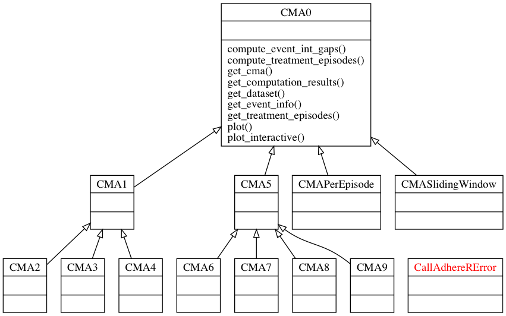
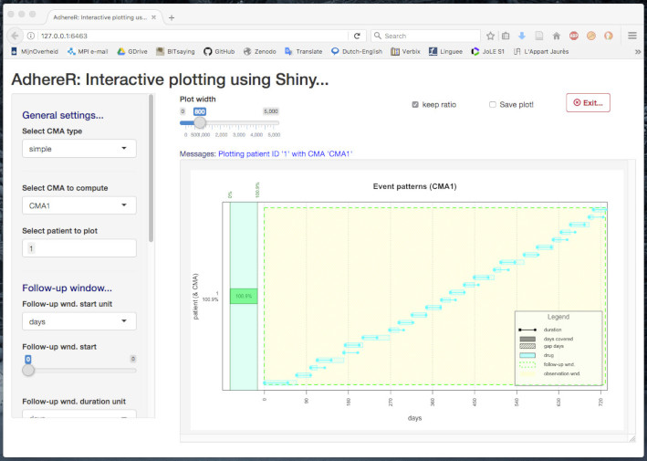

```{r, echo=FALSE, message=FALSE, warning=FALSE, results='hide'}
# Various Rmarkdown output options:
# center figures and reduce their file size:
knitr::opts_chunk$set(fig.align = "center", dpi=100, dev="jpeg"); 
```

## Table of Contents

  - [Introduction](#introduction)
  
  - [General ideas](#general-ideas)
  
  - [Fundamentals of calling `AdhereR` from `Python 3`](#fundamentals-of-calling-adherer-from-python-3)
  
  - [The `Python 3` wrapper: the `adherer` module](#the-python-3-wrapper-the-adherer-module)
  
      - [Importing the `adherer` module and initializations](#importing-the-adherer-module-and-initializations)
    
      - [The class hierarchy](#the-class-hierarchy)
    
          - [The `CallAdhereRError` exception class](#the-calladherererror-exception-class)
          
          - [The base class `CMA0`](#the-base-class-cma0)
          
          - [Class `CMA1` and its daughter classes `CMA2`, `CMA3` and `CMA4`](#class-cma1-and-its-daughter-classes-cma2-cma3-and-cma4)
          
          - [Class `CMA5` and its daughter classes `CMA6`, `CMA7`, `CMA8` and `CMA9`](#class-cma5-and-its-daughter-classes-cma6-cma7-cma8-and-cma9)
          
          - [Classes `CMAPerEpisode` and `CMASlidingWindow`](#classes-cmaperepisode-and-cmaslidingwindow)
          
      - [Examples of use](#examples-of-use)
      
          - [Basic usage](#basic-usage)
          
             - [Importing `adherer` and checking autodetection](#importing-adherer-and-checking-autodetection)
             
             - [Export the test dataset from `R` and import it in `Python`](#export-the-test-dataset-from-r-and-import-it-in-python)
             
             - [Compute and plot test CMA](#compute-and-plot-test-cma)
             
             - [Interactive plotting](#interactive-plotting)
          
          - [Parallel processing (locally and on different machines)](#parallel-processing-locally-and-on-different-machines)
          
             - [Single thread on the local machine](#single-thread-on-the-local-machine)
             
             - [Multi-threaded on the local machine](#multi-threaded-on-the-local-machine)
             
             - [Parallel on remote machines over a network](#parallel-on-remote-machines-over-a-network)
          
  - [Appendix I: the communication protocol](#appendix-i-the-communication-protocol)
  
      - [Context](#context)
      
      - [Protocol](#protocol)
      
      - [PARAMETERS](#parameters1)
      
      - [COMMENTS](#comments)
      
      - [SPECIAL PARAMETERS](#special-parameters2)
      
      - [FUNCTIONS](#functions)
      
      - [PLOTTING](#plotting)
      
      - [`CMA1`, `CMA2`, `CMA3`, `CMA4`](#cma1-cma2-cma3-cma4)
      
      - [`CMA5`, `CMA6`, `CMA7`, `CMA8`, `CMA9`](#cma5-cma6-cma7-cma8-cma9)
      
      - [`CMA_per_episode`](#cma_per_episode)
      
      - [`CMA_sliding_window`](#cma_sliding_window)
      
      - [`compute_event_int_gaps`](#compute_event_int_gaps)
      
      - [`compute_treatment_episodes`](#compute_treatment_episodes)
      
      - [`plot_interactive_cma`](#plot_interactive_cma)
      
  - [Appendix II: the `Python 3` code](#appendix-ii-the-python-3-code)
      
  - [Notes](#notes)


## Introduction

While `AdhereR` is written in `R` and makes extensive use of various `R` packages and techniques (such as `data.table` and parallel processing), it is possible to use it from other programming languages and applications.
This is accomplished through a very generic mecahnism that only requires the caller to be able to *read and write files* in a location of its choice and to *invoke an external command* with a set of arguments.
These requirements are widely available in programming languages (such as `C`/`C++`, `Java`, `Python 2` and `3`, and `R` itself), can be accomplished from the scripting available in several applications (e.g., `VBA` in Microsoft Excel, `STATA` scripting or `SAS` programs), and works in similar ways across the major Operating Systems (`Linux` flavors, `macOS` and `Microsoft Windows`).

We present here this generic mechanism using its *reference implementation* for `Python 3`.
While this reference implementation is definitely useable in production environments, this can probably be improved both in terms of calling and passing data between `Python` and `R`, as well as in terms of the "pythonicity" of the `Python` side of the implementation.
Nevertheless, we hope this implementation will be useful to users of `Python` that would like to access `AdhereR` without switching to `R`, and will provide a template and working example for further implementations that aim to make `AdhereR` available to other programming languages and platforms.


## General ideas

The mechanism is very general, and is based on a *wrapper* being available on the *caller platform* (here, `Python 3`) that performs the following general tasks:

  - *exposes* to the users on the caller platform a *set of functions/methods/objects* (or other mechanisms specific to that platform) that encapsulate, in a platform-specific way, the main functionalities from `AdhereR` that are of interest to the platform's users;
  - when the user *calls* such an exposed function with a given set of argument values, the wrapper *transparently translates* these argument values in a format understandable by `AdhereR`; in particular, it saves any datasets to be processed (as TAB-separated `CSV files`) and writes the argument values to `text file` (in a standardised format), all in a directory of its choice (henceforth, the *data sharing directory*);
  - the wrapper uses the *`shell` mechanism* to call `R` (as it is installed on the caller system) and instructs it to execute a simple sequence of `R` commands;
  - these `R` commands load the `AdhereR` package and execute the `callAdhereR()` function from the package, passing it the path to the data sharing directory as its only argument;   
  - internally, `callAdhereR()`:
    - parses and loads the data and arguments, 
    - performs basic consistency checks, 
    - calls the appropriate `AdhereR` method(s) with the appropriate arguments, 
    - checks the results and, as appropriate, 
    - writes back to a predefined file any error messages, warnings or any other messages generated, and, if the case, 
    - saves the results to TAB-separated `CSV` files or image files;
  - the wrapper is notified when the `R` has finished executing, and:
    - loads the file containing the errors, warnings and messages, and possibly the results, 
    - packs them into objects appropriate to the caller platform, and 
    - returns them to the user.

The full protocol is detailed in [**Appendix I**](#appendix-1).


## Fundamentals of calling `AdhereR` from `Python 3`

We will use here a `macOS` setup for illustration purposes, but this is very similar on the other supported `OS`s. 
Essentially, the `Python 3` wrapper creates the *input files* `parameters.log` and `dataset.csv` in the data sharing directory (let us denote it as `DATA_SHARING_DIRECTORY`, by default, a unique temorary directory).
Let's assume that `DATA_SHARING_DIRECTORY` is set to `/var/folders/kx/bphryt7j5tz1n_fcjk5809940000gn/T/adherer-qmx4pw7t`; then, before calling `AdhereR`, this directory should contain the files:

    .
     |-parameters.log
     \-dataset.csv

Please note that `R` must be *properly installed* on the system such that `Rscript` (or `Rscript.exe` on Windows) does exist and works; the `Python 3` wrapper tries to locate it using a variety of strategies (in order, `which`, followed by a set of standard locations on `macOS` and `Linux` or a set of standard Windows Registry Keys on `MS Windows`) but if this fails or if the user wants to use a non-standard `R` installation, the wrapper allows this through the exported function `set_rscript_path()`.
Let's assume for now that `Rscript` is located in `/usr/local/bin/Rscript` and its automatic detection was successful (let us denote this path as `RSCRIPT_PATH`).

With these path variables automatically or manually set, the `Python 3` wrapper is ready to call `AdhereR`:

``` python
import subprocess # allow shell calls

[...]

# Call adhereR:
rscript_cmd = '"' + RSCRIPT_PATH + '"' + ' --vanilla -e ' + \
              '"library(AdhereR); ' + \
              `callAdhereR(` + DATA_SHARING_DIRECTORY + '\')"'
return_code = subprocess.call(rscript_cmd, shell=True)
```

When the `Rscript` process returns, `return_code` should be `0` for success (in the sense of calling `AdhereR`, not in the sense that `AdhereR` also succeeded in the task it was assigned to do) or something else for errors.

If `return_code != 0`, the process returns with a warning.
Otherwise, an attempt is made to read the messages produced by `AdhereR` (available in the `Adherer-results.txt` file in the `DATA_SHARING_DIRECTORY` directory) and checking if the last line begins with `OK:`.
If it does not, a warning contaning the messages is thrown and the process returns.

If it does, the appropriate output files are read, parsed and loaded (depending on the invoked function, these files might differ).
For example, after successfully invoking `CMA1`, the `DATA_SHARING_DIRECTORY` might look like:

    .
     |-parameters.log
     |-dataset.csv
     |-Adherer-results.txt
     \-CMA.csv

In this example, the wrapper would parse and load `CMA.csv` as a `pandas` table:

``` python
import pandas # load pandas

[...]

# Expecting CMA.csv
ret_val['CMA'] = pandas.read_csv(os.path.join(path_to_data_directory,
                                              'CMA.csv'), sep='\t', header=0)
```

If plotting was requested, the resulting plot is also loaded using the `PIL`/`Pillow` library:

``` python
from PIL import Image # load images

[...]

# Load the produced image (if any):
ret_val['plot'] = Image.open(os.path.join((plot_save_to
                                          if not (plot_save_to is None) else
                                          DATA_SHARING_DIRECTORY),
                                          'adherer-plot' + '.' + plot_save_as))
```

where `plot_save_to` and `plot_save_as` may specify where the plots are to be saved and in which format.


## The `Python 3` wrapper: the `adherer` module

The reference implementation is contained in single file (`adherer.py`) included with the `R` `AdhereR` package and whose location can be obtained using the function `getCallerWrapperLocation(full.path=TRUE)` from `AdhereR` (*N.B.* it is located in the directory where the `AdhereR` package is installed on the system, subdirectory `wrappers/python3/adherer.py`; for example, on the example `macos` machine this is `/Library/Frameworks/R.framework/Versions/3.4/Resources/library/AdhereR/wrappers/python3/adherer.py`).
In the future, as more wrappers are added, the argument `callig.platform` will allow the selection of the desired wrapper (now it is implicitely set to `python3`).

This file can be either:

  - *copied and placed* in `Python`'s "module search paths" (a list of directories comprising, in order, the directory contining the input script, the environment variable `PYTHONPATH`, and a default location; see [here](https://docs.python.org/3/tutorial/modules.html#the-module-search-path) for details), in which cae it can be simply imported using the standard `Python` syntax (e.g. `import adherer` or `import adherer as ad`), or
  - *imported from its location* by either:
    - adding its directory to the `PYTHONPATH` environment variable [the recommended solution], or
    - using various tricks described, for example, [here](https://stackoverflow.com/a/67692).

On the example `macos` machine, this can be achieved by adding:
``` bash
# Add AdhereR to PYTHONPATH
export PYTHONPATH=$PYTHONPATH:/Library/Frameworks/[...]/AdhereR/wrappers/python3
```
to the `.bash_profile` file in the user's home folder (if this file does not exist, then it can be created using a text editor such as `nano`; please note that the `[...]` are for shortening the path and should be replaced by the actual path given in full above).
The process should be very similar on `Linux`, while on `MS Windows` one should use the system's "Environment Variables" settings (for example, see [here](https://stackoverflow.com/a/4855685) for details).

Please note that `adherer` needs `pandas` and `PIL`, which can be installed, for example, using:
``` bash
pip3 install pandas
pip3 install Pillow
```


*NOTE:* we will consistently use `AdhereR` to refer to the `R` package, and `adherer` to refer to the `Python 3` module.


### Importing the `adherer` module and initializations

Thus, the reference implementation is technically a `module` called `adherer` that can be imported in your code (we assume here the recommended solution, but see above for other ways of doing it):

``` python
# Import adherer as ad:
import adherer as ad
```

When the `adherer` module is imported for the first time, it runs the following *initialization code*:

  1. it tries to **autodetect the location where `R` is installed on the system**. More precisely, it looks for `Rscript` (or `Rscript.exe` on Windows) using several strategies, in order: `which`, followed by a set of standard locations on `macOS` (`/usr/bin/Rscript`, `/usr/local/bin/Rscript`, `/opt/local/bin/Rscript` and `/Library/Frameworks/R.framework/Versions/Current/Resources/bin/Rscript`) and `Linux` (`/usr/bin/Rscript`, `/usr/local/bin/Rscript`, `/opt/local/bin/Rscript` and `~/bin/Rscript`) or a set of standard Windows Registry Keys on `MS Windows` (`HKEY_CURRENT_USER\SOFTWARE\R-core\R`, `HKEY_CURRENT_USER\SOFTWARE\R-core\R32`, `HKEY_CURRENT_USER\SOFTWARE\R-core\R64`, `HKEY_LOCAL_MACHINE\SOFTWARE\R-core\R`, `HKEY_LOCAL_MACHINE\SOFTWARE\R-core\R32` and `HKEY_LOCAL_MACHINE\SOFTWARE\R-core\R64`) which should contain `Current Version` and `InstallPath` (with the added complexity that 64 bits Windows hists both 32 and 64 bits regsistries). This procedure is inspired by the way [`RStudio` checks for `R`](https://support.rstudio.com/hc/en-us/articles/200486138-Using-Different-Versions-of-R):
    - if this process **fails**, a warning is thrown instructing the user to manually set the path using the `set_rscript_path()` function exposed by the `adherer` module, and sets the internal variable `_RSCRIPT_PATH` to `None` (which insures that all future calls to `AdhereR` will fail;
    - if the process **succeeds**, it checks if the `AdhereR` package is installed for the detected `R` and has a correct version:
        + if this check **fails**, an appropriate warning is thrown and `_RSCRIPT_PATH` is set to `None`;
        + if it **succeeds**, continue to step (2) below.
  2. it tries to **create a temporary directory** (with prefix `adherer-`) with read and write access for the current user:
    - if this **fails**, it throws a warning instructing the user to manually set this to a directory with read & write access using the `set_data_sharing_directory()` function, and sets the internal variable `_DATA_SHARING_DIRECTORY` to `None` (ensuring that calls to `AdhereR` will fail);
    - if it **succeeds**, the initialization code is considered to have finished successfully; also, on exit this temporary `_DATA_SHARING_DIRECTORY` is automatically deleted.


### The class hierarchy

The `adherer` module tries to emulate the same philosophy as the `AhereR` package, where various *types* of *CMAs* ("continuous multiple-interval measures of medication availability/gaps") that implement different ways of computing adherence encapsulate the data on which they were computed, the various relevant parameter values used, as well as the results of the computation.

Here, we implemented this through the following class hierarchy (image generated with [pyreverse](https://www.logilab.org/blogentry/6883), not showing the private attributes):



We will discuss now the main classes in turn.


#### The `CallAdhereRError` exception class

Errors in the `adherer` code are signalled by throwing `CallAdhereRError` exceptions (the red class shown in the bottom right corner).


#### The base class `CMA0`

All classes that implement ways to compute adherence (`CMA`s) are derived from `CMA0`.
`CMA0` does not in itself compute any sort of adherence, but instead provides the *infrastructure* for *storing* the data, parameter values and results (including errors), and for *interacting* with `AdhereR`.
Please note that in the "higher" `CMA`s, the class constructor `__init()__` implicitely performs the actual computation of the `CMA` and saves the results (for `CMA0` there are no such computations and `__init()__` only saves the parameters internally)! 

1. **storage of data and parameter values**: `CMA0` allows the user to set various parameters through the constructor `__init()__`, parameters that are stored for later use, printing, saving, and for facilitating easy reconstruction of all types of computations. By main groups, these are (please, see the manual entry for `?CMA0` in the `AdhereR` package and the full protocol in [**Appendix I**](#appendix-1) as well):
  
  - `dataset` stores the primary data (as a `Pandas` table with various columns) containing the actual events; must be given;
    
  - `id_colname`, `event_date_colname`, `event_duration_colname`, `event_daily_dose_colname` and `medication_class_colname`: these give the *names* of the columns in the `dataset` table containing important information about the events (the first three are required, the last two are optional);
    
  - `carryover_within_obs_window`, `carryover_into_obs_window`, `carry_only_for_same_medication`, `consider_dosage_change`, `medication_change_means_new_treatment_episode`, `maximum_permissible_gap`, `maximum_permissible_gap_unit`: optional parameters defining the types of carry-over, changes and treatment episode triggers;
    
  - `followup_window_start_type`, `followup_window_start `followup_window_start_unit`, `followup_window_duration_type `followup_window_duration`, `followup_window_duration_unit`, `observation_window_start_type`, `observation_window_start`, `observation_window_start_unit `observation_window_duration_type`, `observation_window_duration`, `observation_window_duration_unit`: optional parameters defining the follow-up and observation windows;
    
  - `sliding_window_start_type`, `sliding_window_start`, `sliding_window_start_unit`, `sliding_window_duration_type`, `sliding_window_duration`, `sliding_window_duration_unit`, `sliding_window_step_duration_type`, `sliding_window_step_duration`, `sliding_window_step_unit`, `sliding_window_no_steps`: optional parameters defining the sliding windows;
    
  - `cma_to_apply`: optional parameter specifying which "simple" `CMA` is to be used when computing sliding windos and treatment episodes;
    
  - `date_format`: optional parameter describing the format of column dates in `dataset` (defaults to month/day/year);
    
  - `event_interval_colname`, `gap_days_colname`: optional parameters allowing the user to change the names of the columns where these computed data are stored in the resuling table;
    
  - `force_na_cma_for_failed_patients`, `keep_window_start_end_dates`, `remove_events_outside_followup_window`, `keep_event_interval_for_all_events`: optional parameters governing the content of the resuling table;
    
  - `parallel_backend`, `parallel_threads`: these optional parameters control the parallelism of the computations (if any); see **PARALLEL PROCESSING** for details;
    
  - `suppress_warnings`: should all the internal warning be shown?
    
  - `save_event_info`: should this "advanced" info be also made available?
    
  - `na_symbol_numeric`, `na_symbol_string`, `logical_symbol_true`, `logical_symbol_false`, `colnames_dot_symbol`, `colnames_start_dot`: these optional parameters allow `AdhereR` to adapt to "non-`R`" conventions concerning the data format for missing values, logicals and column names;
    
  - `path_to_rscript`, `path_to_data_directory`: these parameters allow the user to override the `_RSCRIPT_PATH` and `_DATA_SHARING_DIRECTORY` variables;
    
  - `print_adherer_messages`: should the important messages be printed to the user as well?

2. **storage of, and access to, the results**:
  
  - `get_dataset()`: returns the internally saved `Pandas` table `dataset`;
    
  - `get_cma()`: returns the computed `CMA` (if any);
    
  - `get_event_info()`: returns the computed event information (if any);
    
  - `get_treatment_episodes()`: returns the computed treatment episodes information (if any);
    
  - `get_computation_results()`: return the results of the last computation (if any); more precisely, a `dictionary` containing the numeric `code` returned by `AdhereR` and the string `messages` written by `AdhereR` during the computation;

3. **computing event interval and treatment episode info**: this can be done by explicitelly calling the `compute_event_int_gaps()` and `compute_treatment_episodes()` functions;
  
4. **plotting**: 
  
  - *static plotting*: this is realized by the `plot()` function that takes several plotting-specific parameters:
    
      + `patients_to_plot`: should a subset of the patients present in the `dataset` be plotted (by default, all will be)?
      
      + `save_to`, `save_as`, `width`, `height`, `quality`, `dpi`: where should the plot be saved, in what format, dimentions and quality?
      
      + `duration`, `align_all_patients`, `align_first_event_at_zero`, `show_period`, `period_in_days`: duration to plots and alignment of patients;
        
      + `show_legend`, `legend_x`, `legend_y`, `legend_bkg_opacity`: legend parameters;
        
      + `cex`, `cex_axis`, `cex_lab`: the relative size of various text elements;
        
      + `show_cma`, `print_cma`, `plot_cma`, `plot_cma_as_histogram`, `cma_plot_ratio`, `cma_plot_col`, `cma_plot_border`, `cma_plot_bkg`, `cma_plot_text`: should the cma be shown and how?
        
      + `unspecified_category_label`: implicit label of unlabelled categories?
        
      + `lty_event`, `lwd_event`, `pch_start_event`, `pch_end_event`, `show_event_intervals`, `col_na`, `col_continuation`, `lty_continuation`, `lwd_continuation`: visual aspects of events and continuations;
        
      + `highlight_followup_window`, `followup_window_col`, `highlight_observation_window`, `observation_window_col`, `observation_window_density`, `observation_window_angle`, `show_real_obs_window_start`, `real_obs_window_density`, `real_obs_window_angle`:  visual appearance of the follow-up, obervation and "real observation" windows (the latter for `CMA`s that djust it);
        
      + `bw_plot`: produce a grayscel plot?
        
  - *interactive plotting*: the `plot_interactive()` function launches a [Shiny](https://shiny.rstudio.com/)-powered interactive plot using the system's WEB browser; the only parameter `patient_to_plot` may specify which patient to show initially, as all the relevant parameters can be interactively altered ar run-time;
     
5. **printing**: the `__repr__()` function implements a very simple printing mechanism showing the `CMA` type and a summary of the `dataset`;
      
6. **calling `AdhereR`**: the private function `_call_adherer()` is the real workhorse that manages all the interaction with the `R` `AdhereR` package as described above. This function can take many parameters covering *all* that `AdhereR` can do, but it is not intended to be directly called by the end-user but instead to be internally called by various exposed functions such as `plot()`, `compute_event_int_gaps()` and `__init()__`. Roughly, after some checks, it creates the files needed for communication, calls `AdhereR`, analyses any errors, warnings and messages that it might have generated, and packs the results in a manageable format.

To preserve the generality of the interaction with `AdhereR`, all the `CMA` classes define a private static member `_adherer_function` which is the name of the corresponding `S3` class as implemented in `AdhereR`.


#### Class `CMA1` and its daughter classes `CMA2`, `CMA3` and `CMA4`

`CMA1` is derived from `CMA0` by redefining the `__init__()` constructor to (a) take only a subset of arguments relevant for the `CMA`s 1--4 (see the `AdhereR` help for them), and (b) to internally call `_call_adherer()` with these parameters.
It checks if the result of `_call_adherer()` signals an error, in which case ir throws a `CallAdhereRError` exception, otherwise packing the code, messages, cma and (possibly) event information in the corresponding member variables for later access.

Due to the generic mechanism implemented by `_adherer_function`, `CMA2`, `CMA3` and `CMA4` are derived directly from `CMA1` but only redefine `_adherer_function` appropriately.


#### Class `CMA5` and its daughter classes `CMA6`, `CMA7`, `CMA8` and `CMA9`

The same story applies here, with `CMA5` being derived from `CMA0` and redefining `__init__()`, with `CMA6`--`CMA9` only using the `_adherer_function` mechanism.
Compared with `CMA1`, `CMA5` defines new required arguments related to medication type and dosage.


#### Classes `CMAPerEpisode` and `CMASlidingWindow`

Just like `CMA1` and `CMA5`, these two require specific parameters and are thus derived directly from `CMA0` (but, in contrast, they don't have their own derived classes).


### Examples of use

Below we show some examples of using the `Python 3` reference wrapper.
We are using [`IPython`](https://ipython.org/) from the [`Spyder 3`](https://github.com/spyder-ide/spyder) environment; the `In [n]: ` represents the *input* prompt, the `   ...: ` the *continuation* of the input on the following line(s), and `Out[n]: ` the produced output.


#### Basic usage

##### Importing `adherer` and checking autodetection

``` python
Python 3.6.5 (v3.6.5:f59c0932b4, Mar 28 2018, 05:52:31)
Type "copyright", "credits" or "license" for more information.

IPython 6.3.0 -- An enhanced Interactive Python.

In [1]: # Import adherer as ad:
   ...: import adherer as ad

In [2]: # Show the _DATA_SHARING_DIRECTORY (should be set automatically to a temporary location):
   ...: ad._DATA_SHARING_DIRECTORY.name
Out[2]: '/var/folders/kx/bphryt7j5tz1n_fcjk5809940000gn/T/adherer-05hdq6el'

In [3]: # Show the _RSCRIPT_PATH (should be dectedt automatically):
   ...: ad._RSCRIPT_PATH
Out[3]: '/usr/local/bin/Rscript'
```

Everything seems fine!

##### Export the test dataset from `R` and import it in `Python`

Let's export the sample dataset `med.events` included in `AdhereR` as a TAB-separated CSV file in a location for use here (please note that this must be done from an `R` console, such as from `RStudio`, and not from `Python`!):

``` R
R version 3.4.3 (2017-11-30) -- "Kite-Eating Tree"
Copyright (C) 2017 The R Foundation for Statistical Computing
Platform: x86_64-apple-darwin15.6.0 (64-bit)

R is free software and comes with ABSOLUTELY NO WARRANTY.
You are welcome to redistribute it under certain conditions.
Type 'license()' or 'licence()' for distribution details.

  Natural language support but running in an English locale

R is a collaborative project with many contributors.
Type 'contributors()' for more information and
'citation()' on how to cite R or R packages in publications.

Type 'demo()' for some demos, 'help()' for on-line help, or
'help.start()' for an HTML browser interface to help.
Type 'q()' to quit R.

> library(AdhereR) # load the AdhereR package
> head(med.events) # see how the included med.events dataset looks like
    PATIENT_ID       DATE PERDAY CATEGORY DURATION
286          1 04/26/2033      4     medA       50
287          1 07/04/2033      4     medB       30
288          1 08/03/2033      4     medB       30
289          1 08/17/2033      4     medB       30
291          1 10/13/2033      4     medB       30
290          1 10/16/2033      4     medB       30
> write.table(med.events, file="~/Temp/med-events.csv", quote=FALSE, sep="\t", row.names=FALSE, col.names=TRUE) # save med.events as TAB-separated CSV file in a location (here, in the Temp folder)
> 
```

Now, back to `Python`:

``` python
In [4]: # Import Pandas as pd:
   ...: import pandas as pd

In [5]: # Load the test dataset
   ...: df = pd.read_csv('~/Temp/med-events.csv', sep='\t', header=0)

In [6]: # Let's look at first 6 rows (it should match the R output above except for the row names):
   ...: df.head(6)
Out[6]: 
   PATIENT_ID        DATE  PERDAY CATEGORY  DURATION
0           1  04/26/2033       4     medA        50
1           1  07/04/2033       4     medB        30
2           1  08/03/2033       4     medB        30
3           1  08/17/2033       4     medB        30
4           1  10/13/2033       4     medB        30
5           1  10/16/2033       4     medB        30
```

All good so far, the data was imported successfully as a `Pandas` table.

##### Compute and plot test CMA

Now let's compute `CMA8` on these data in `Python`:

``` python
In [7]: # Compute CMA8 as a test:
   ...: cma8 = ad.CMA8(df,
   ...:                id_colname='PATIENT_ID',
   ...:                event_date_colname='DATE',
   ...:                event_duration_colname='DURATION',
   ...:                event_daily_dose_colname='PERDAY',
   ...:                medication_class_colname='CATEGORY')
   ...:  
Adherer returned code 0 and said:
AdhereR 0.2.0 on R 3.4.3 started at 2018-06-04 22:27:10:
OK: the results were exported successfully (but there might be warnings and messages above worth paying attention to)!
```

We can see that things went pretty well, as no exceptions were being thrown and the message starts with a reassuring `Adherer returned code 0`, followed by precisely what `AdhereR` said: 

  - `AdhereR 0.2.0 on R 3.4.3 started at 2018-06-04 22:27:10:`: first, self-identification (its own version and `R`'s version), followed by the date and time the processing was initated;
  - `OK: the results were exported successfully (but there might be warnings and messages above worth paying attention to)!`, which means that basically all seems allright but that there might still be some messages or warning displayed above that could be informative or point to subtler issues.

Let's see how these results look like:

``` python
In [8]: # Summary of cma8:
   ...: cma8
Out[8]: CMA object of type CMA8 (on 1080 rows).

In [9]: # The return value and messages:
   ...: cma8.get_computation_results()
Out[9]: 
{'code': 0,
 'messages': ['AdhereR 0.2.0 on R 3.4.3 started at 2018-06-04 22:27:10:\n',
  'OK: the results were exported successfully (but there might be warnings and messages above worth paying attention to)!\n']}

In [10]: # The CMA (the first 6 rows out of all 100):
    ...: cma8.get_cma().head(6)
Out[10]: 
   PATIENT_ID       CMA
0           1  0.947945
1           2  0.616438
2           3  0.994521
3           4  0.379452
4           5  0.369863
5           6  0.406849

In [11]: # Plot it (statically):
    ...: cma8.plot(patients_to_plot=['1', '2', '3'],
    ...:           align_all_patients=True,
    ...:           period_in_days=30,
    ...:           cex=0.5)
    ...:           
Adherer returned code 0 and said:
AdhereR 0.2.0 on R 3.4.3 started at 2018-06-05 13:22:36:
OK: the results were exported successfully (but there might be warnings and messages above worth paying attention to)!

Out[11]: 
```

The output produced in this case (`Out[11]`) consists of the actual image plotted in the `IPython` console (thanks to the `PIL`/`Pillow` package) and reproduced below:


Now, we turn again to `R`:

``` R
> # Compute the same CMA8 in R:
> cma8 <- CMA8(data=med.events,
+              ID.colname="PATIENT_ID",
+              event.date.colname="DATE",
+              event.duration.colname="DURATION",
+              medication.class.colname="CATEGORY",
+              event.daily.dose.colname="PERDAY"
+ )
>
> # The computed CMA:
> head(getCMA(cma8))
  PATIENT_ID       CMA
1          1 0.9479452
2          2 0.6164384
3          3 0.9945205
4          4 0.3794521
5          5 0.3698630
6          6 0.4068493
>
> # Plot the cma:
> plot(cma8,
+      patients.to.plot=c("1", "2", "3"),
+      align.all.patients=TRUE,
+      period.in.days=30,
+      cex=0.5)
>
```

Again, the output is an image (here, shown in the "Plots" panel in `RStudio`):


It can be seen that, except for the slightly different dimensions (and x/y ratio and quality) due to the actual plotting and exporting, the images show identical patterns.

##### Interactive plotting

We will initate now an interactive plotting session from `Python`:

``` python
In [12]: cma8.plot_interactive()
```

The output is represented by an interactive session in the default browser; below is a screenshot of this session in `Firefox`:

The interactive session ends by pressing the "Exit" button in the browser (and optinally also closing the browser tab/window), at which point the usual text output is provided to `Python` and a `True` value signalling success is returned:

``` python
Adherer returned code 0 and said:
AdhereR 0.2.0 on R 3.4.3 started at 2018-06-05 18:01:28:
OK: the results were exported successfully (but there might be warnings and messages above worth paying attention to)!

Out[12]: True
```

Please note that it does not matter how the interactive session is started, as it only needs access to the base `CMA0` object and, more precisely, the raw dataset; all relevant parameters, including the CMA type can be changed interactively (this is why the CMA shown in the screenshot is `CMA1` even if the function `cma8.plot_interactive()` was initiated from a `CMA8` object).


#### Parallel processing (locally and on different machines)

`AdhereR` uses `R`'s parallel procesing capacities to split expensive computations and distribute them across multiple CPUs/cores in a single computer or even across a network of computers.
As an example, we will compute here `CMA1` across sliding windows on the whole dataset, first in `R` and then in `Python 3`.

##### Single thread on the local machine

The default mode of computation uses just a single CPU/core on the local machine.

###### `R`

``` R
> # Sliding windows with CMA1 (single thread, locally):
> cma1w.1l <- CMA_sliding_window(CMA.to.apply="CMA1",
+                                data=med.events,
+                                ID.colname='PATIENT_ID',
+                                event.date.colname='DATE',
+                                event.duration.colname='DURATION',
+                                event.daily.dose.colname='PERDAY',
+                                medication.class.colname='CATEGORY',
+                                sliding.window.duration=30,
+                                sliding.window.step.duration=30,
+                                parallel.backend="none",
+                                parallel.threads=1)
> head(getCMA(cma1w.1l))
  PATIENT_ID window.ID window.start window.end       CMA
1          1         1   2033-04-26 2033-05-26        NA
2          1         2   2033-05-26 2033-06-25        NA
3          1         3   2033-06-25 2033-07-25        NA
4          1         4   2033-07-25 2033-08-24  2.142857
5          1         5   2033-08-24 2033-09-23        NA
6          1         6   2033-09-23 2033-10-23 10.000000
>
```

###### `Python 3`

``` python
In [13]: # Sliding windows with CMA1 (single thread, locally):
    ...: cma1w_1l = ad.CMASlidingWindow(dataset=df,
    ...:                                cma_to_apply="CMA1",
    ...:                                id_colname='PATIENT_ID',
    ...:                                event_date_colname='DATE',
    ...:                                event_duration_colname='DURATION',
    ...:                                event_daily_dose_colname='PERDAY',
    ...:                                medication_class_colname='CATEGORY',
    ...:                                sliding_window_duration=30,
    ...:                                sliding_window_step_duration=30,
    ...:                                parallel_backend="none",
    ...:                                parallel_threads=1)
    ...:                                
Adherer returned code 0 and said:
AdhereR  0.2.0 on R 3.4.3 started at 2018-06-06 15:19:07:
OK: the results were exported successfully (but there might be warnings and messages above worth paying attention to)!

In [14]: cma1w_1l.get_cma().head(6)
Out[14]: 
   PATIENT_ID  window.ID window.start  window.end        CMA
0           1          1   04/26/2033  05/26/2033        NaN
1           1          2   05/26/2033  06/25/2033        NaN
2           1          3   06/25/2033  07/25/2033        NaN
3           1          4   07/25/2033  08/24/2033   2.142857
4           1          5   08/24/2033  09/23/2033        NaN
5           1          6   09/23/2033  10/23/2033  10.000000
```


##### Multi-threaded on the local machine

If the local machine has multiple CPUs/cores (even with hyperthreading), it might make sense to use them for lengthy computations.
`AdhereR` can use several backends (as provided by the `parallel` package in `R`), of which the most used are "multicore" (preffered on `Linux` and `macOS` but currently not available on `Windows`) and "SNOW" (on all three OS's).
`AdhereR` is smart enough to use "SNOW" on `Windows` even if "multicore" was requested.

###### `R`

``` R
> # Sliding windows with CMA1 (two threads, multicore, locally):
> cma1w.2ml <- CMA_sliding_window(CMA.to.apply="CMA1",
+                                 data=med.events,
+                                 ID.colname='PATIENT_ID',
+                                 event.date.colname='DATE',
+                                 event.duration.colname='DURATION',
+                                 event.daily.dose.colname='PERDAY',
+                                 medication.class.colname='CATEGORY',
+                                 sliding.window.duration=30,
+                                 sliding.window.step.duration=30,
+                                 parallel.backend="multicore", # <--- multicore
+                                 parallel.threads=2)
> head(getCMA(cma1w.2ml))
  PATIENT_ID window.ID window.start window.end       CMA
1          1         1   2033-04-26 2033-05-26        NA
2          1         2   2033-05-26 2033-06-25        NA
3          1         3   2033-06-25 2033-07-25        NA
4          1         4   2033-07-25 2033-08-24  2.142857
5          1         5   2033-08-24 2033-09-23        NA
6          1         6   2033-09-23 2033-10-23 10.000000
> 
> cma1w.2sl <- CMA_sliding_window(CMA.to.apply="CMA1",
+                                 data=med.events,
+                                 ID.colname='PATIENT_ID',
+                                 event.date.colname='DATE',
+                                 event.duration.colname='DURATION',
+                                 event.daily.dose.colname='PERDAY',
+                                 medication.class.colname='CATEGORY',
+                                 sliding.window.duration=30,
+                                 sliding.window.step.duration=30,
+                                 parallel.backend="snow", # <--- SNOW
+                                 parallel.threads=2)
> head(getCMA(cma1w.2sl))
  PATIENT_ID window.ID window.start window.end       CMA
1          1         1   2033-04-26 2033-05-26        NA
2          1         2   2033-05-26 2033-06-25        NA
3          1         3   2033-06-25 2033-07-25        NA
4          1         4   2033-07-25 2033-08-24  2.142857
5          1         5   2033-08-24 2033-09-23        NA
6          1         6   2033-09-23 2033-10-23 10.000000
> 
```

###### `Python 3`

``` python
In [15]: # Sliding windows with CMA1 (two threads, multicore, locally):
    ...: cma1w_2ml = ad.CMASlidingWindow(dataset=df,
    ...:                                 cma_to_apply="CMA1",
    ...:                                 id_colname='PATIENT_ID',
    ...:                                 event_date_colname='DATE',
    ...:                                 event_duration_colname='DURATION',
    ...:                                 event_daily_dose_colname='PERDAY',
    ...:                                 medication_class_colname='CATEGORY',
    ...:                                 sliding_window_duration=30,
    ...:                                 sliding_window_step_duration=30,
    ...:                                 parallel_backend="multicore",  # <--- multicore
    ...:                                 parallel_threads=2)
    ...:                                 
Adherer returned code 0 and said:
AdhereR  0.2.0 on R 3.4.3 started at 2018-06-07 11:44:49:
OK: the results were exported successfully (but there might be warnings and messages above worth paying attention to)!


In [16]: cma1w_2ml.get_cma().head(6)
Out[16]: 
   PATIENT_ID  window.ID window.start  window.end        CMA
0           1          1   04/26/2033  05/26/2033        NaN
1           1          2   05/26/2033  06/25/2033        NaN
2           1          3   06/25/2033  07/25/2033        NaN
3           1          4   07/25/2033  08/24/2033   2.142857
4           1          5   08/24/2033  09/23/2033        NaN
5           1          6   09/23/2033  10/23/2033  10.000000

In [17]: # Sliding windows with CMA1 (two threads, snow, locally):
    ...: cma1w_2sl = ad.CMASlidingWindow(dataset=df,
    ...:                                 cma_to_apply="CMA1",
    ...:                                 id_colname='PATIENT_ID',
    ...:                                 event_date_colname='DATE',
    ...:                                 event_duration_colname='DURATION',
    ...:                                 event_daily_dose_colname='PERDAY',
    ...:                                 medication_class_colname='CATEGORY',
    ...:                                 sliding_window_duration=30,
    ...:                                 sliding_window_step_duration=30,
    ...:                                 parallel_backend="snow",  # <--- SNOW
    ...:                                 parallel_threads=2)
    ...:                                 
Adherer returned code 0 and said:
AdhereR  0.2.0 on R 3.4.3 started at 2018-06-07 11:44:49:
OK: the results were exported successfully (but there might be warnings and messages above worth paying attention to)!


In [18]: cma1w_2sl.get_cma().head(6)
Out[18]: 
   PATIENT_ID  window.ID window.start  window.end        CMA
0           1          1   04/26/2033  05/26/2033        NaN
1           1          2   05/26/2033  06/25/2033        NaN
2           1          3   06/25/2033  07/25/2033        NaN
3           1          4   07/25/2033  08/24/2033   2.142857
4           1          5   08/24/2033  09/23/2033        NaN
5           1          6   09/23/2033  10/23/2033  10.000000
```


##### Parallel on remote machines over a network

Sometimes it is better to use one or more powerful machines over a network to do very expensive computations, usually, a `Linux` cluster from a `Windows`/`macos` laptop.
`AdhereR` leverages the power of `R`'s [`snow`](https://CRAN.R-project.org/package=snow) package (as exposed through the `parallel` package) to distribute workloads across a network of computing nodes.
There are several types of "Simple Network of Workstations" (`snow`), described in the package's manual.
For example, one may use an already existing `MPI` ([Message Passing Interface](https://en.wikipedia.org/wiki/Message_Passing_Interface)) cluster, but an even simpler setup (and the one that we will illustrate here) involves a *collection of machines* running `Linux` and connected to a network (local or even over the Internet).

The machines are called `workhorse1` and `workhorse2`, have differen hardware configurations (both sport quad-core i7 CPUs of different generations with 16Gb RAM) but run the same version of `Ubuntu 16.04` and `R 3.4.2` (not a requirement, as the architecture can be seriously heterogeneous, combining different OS's and versions of `R`).
These two machines are connected to the same WiFi router (but they could be on different networks or even across the Internet).
The "master" is the same `macOS` laptop used before, connected to the same WiFi router (not a requirement).

As pre-requisites, the worker machines should allow [`SSH`](https://help.ubuntu.com/community/SSH/OpenSSH/Configuring) access (for easiness, we use here *passwordless SSH access* from the "master"; see for example [here](http://www.linuxproblem.org/art_9.html) for this setup) and should have the `snow` package installed in `R`.
Let's assume that the username allowing `ssh` into the workers is `user`, so that
``` bash
laptop:~> ssh user@workhorse1
```
works with no password needed.
With these, we can distribute our processing to the two "workers" (two parallel threads for each, totalling 4 parallel threads):

###### `R`

``` R
> # Sliding windows with CMA1 (two remote machines with two threads each):
> # First, we need to specify the workers
> # This is a list of lists!
> # rep(,2) means that we generate two threads on each worker
> workers <- c(rep(list(list(host="workhorse1", # hostname (make sure this works from the "master", otherwise use the IP-address)
+                            user="user", # the username that can ssh into the worker (passwordless highly recommended)
+                            rscript="/usr/local/bin/Rscript", # the location of Rscript on the worker
+                            snowlib="/usr/local/lib64/R/library/")), # the location of the snow package on the worker
+                  2),
+                  rep(list(list(host="workhorse2", 
+                            user="user", 
+                            rscript="/usr/local/bin/Rscript", 
+                            snowlib="/usr/local/lib64/R/library/")),
+                  2));
>
> cma1w.2sw <- CMA_sliding_window(CMA="CMA1",
+                                 data=med.events,
+                                 ID.colname="PATIENT_ID",
+                                 event.date.colname="DATE",
+                                 event.duration.colname="DURATION",
+                                 event.daily.dose.colname="PERDAY",
+                                 medication.class.colname="CATEGORY",
+                                 carry.only.for.same.medication=FALSE,
+                                 consider.dosage.change=FALSE,
+                                 sliding.window.duration=30,
+                                 sliding.window.step.duration=30,
+                                 parallel.backend="snow",
+                                 parallel.threads=workers)
> head(getCMA(cma1w.2sw))
  PATIENT_ID window.ID window.start window.end       CMA
1          1         1   2033-04-26 2033-05-26        NA
2          1         2   2033-05-26 2033-06-25        NA
3          1         3   2033-06-25 2033-07-25        NA
4          1         4   2033-07-25 2033-08-24  2.142857
5          1         5   2033-08-24 2033-09-23        NA
6          1         6   2033-09-23 2033-10-23 10.000000
> 
```

###### `Python 3`

A quick for `Python` is that due to the communication protocol between the wrapper and `AdhereR`, the specification of the computer cluster must be a one-line string literally contaning the `R` code defining it, string that will be verbatim parsed and interpreted by `AdhereR`:

``` python
In [19]: # Sliding windows with CMA1 (two remote machines with two threads each):
    ...: # The workers are defined as *literal R code* this is verbatim sent to AdhereR for parsing and interpretation
    ...: # Please note, however, that this string should not contain line breaks (i.e., it should be a one-liner):
    ...: workers = 'c(rep(list(list(host="workhorse1", user="user", rscript="/usr/local/bin/Rscript", snowlib="/usr/local/lib64/R/library/")), 2), rep(list(list(host="workhorse2", user="user", rscript="/usr/local/bin/Rscript", snowlib="/usr/local/lib64/R/library/")), 2))'

In [20]: cma1w_2sw = ad.CMASlidingWindow(dataset=df,
    ...:                                 cma_to_apply="CMA1",
    ...:                                 id_colname='PATIENT_ID',
    ...:                                 event_date_colname='DATE',
    ...:                                 event_duration_colname='DURATION',
    ...:                                 event_daily_dose_colname='PERDAY',
    ...:                                 medication_class_colname='CATEGORY',
    ...:                                 sliding_window_duration=30,
    ...:                                 sliding_window_step_duration=30,
    ...:                                 parallel_backend="snow",
    ...:                                 parallel_threads=workers)
Adherer returned code 0 and said:
AdhereR 0.2.0 on R 3.4.3 started at 2018-06-07 13:22:21:
OK: the results were exported successfully (but there might be warnings and messages above worth paying attention to)!


In [21]: cma1w_2sw.get_cma().head(6)
Out[21]: 
   PATIENT_ID  window.ID window.start  window.end        CMA
0           1          1   04/26/2033  05/26/2033        NaN
1           1          2   05/26/2033  06/25/2033        NaN
2           1          3   06/25/2033  07/25/2033        NaN
3           1          4   07/25/2033  08/24/2033   2.142857
4           1          5   08/24/2033  09/23/2033        NaN
5           1          6   09/23/2033  10/23/2033  10.000000
```

###### Some caveats for over-the-network distributed computation

While this is a very good way to transparently distribute processing to more powerful nodes over a network, there are several (potential) issues one must be aware of:

  - *it may be very hard to debug failures*: failures of this might result from network issues, firewals blocking connections, incorrect `SSH` setup on the "workers" or errors in accesing the "workers" with the given user accounts; see, for examples, discussion [here](https://stackoverflow.com/q/17966055) and [here](https://stackoverflow.com/questions/17923256/r-making-cluster-in-doparallel-snowfall-hangs/17925618#17925618) in case you need to solve such problems;

  - *latency over the network*: starting the "workers" and especially transmitting the data to the "workers" and the results back to the "master" may take a non-negligible time, especially on slow networks (such as the Internet) and for large datasets; therefore, the best scenarios would involve relatively large computations (but not too large; see below) distributed to several nodes over a fast network;
  
  - *you need to wait for the results*: this process assumes that the "master" will wait for the "workers" to finish and return their results; thus, putting the "master" to sleep, shutting it down or disconnecting it from the network will probably result in not being able to collect the resuls back. If one needs very long computations (say 3+ hours), offline mobility or the network is unreliable, we would suggest setting up a separate compute process (that may itself parallelise computations) on the remote machines using, for example, [`screen`](https://www.howtoforge.com/linux_screen), [`nohup`](https://en.wikipedia.org/wiki/Nohup) or a more specialised cluster management platform such as [Son of a Grid Engine (SGE)](https://arc.liv.ac.uk/trac/SGE).


## Appendix I: the communication protocol


### Context

All arguments are written to the text file `parameters.log`; the input data are in the TAB-separated no quotes file `dataset.csv`.
The call returns any errors, warning and messages in the text file `Adherer-results.txt` file, and the actual results as TAB-separated no quotes files (not all necessarily produced, depending on the specific methods called) `CMA.csv`, `EVENTINFO.csv` and `TREATMENTEPISODES.csv`, and various image file(s).
The argument values in the `parameters.log` are contained between single (`' '`) or double (`" "`) quotes.


### Protocol

#### PARAMETERS[^1]
Some are *required* and must be explicitly defined, but for most we can use implicit values (i.e., if the user doesn't set them explicitly, we may simply not specify them to the `parameters.log` file and the default values in `AdhereR` will be used).


#### COMMENTS
Everything on a line following `///` or `#` is considered a comment and ignored (except when included within quotes `" "` or `' '`).


#### SPECIAL PARAMETERS[^2]

| PARAMETER  | MEANING  | DEFAULT VALUE IF MISSING | PYHTON 3 | STATA |
|------------|----------|--------------------------|----------|-------|
| `NA.SYMBOL.NUMERIC` | the numeric missing data symbol | `NA` | `NA` | `.` |
| `NA.SYMBOL.STRING` | the string missing data symbol | `NA` | `NA` | `""` |
| `LOGICAL.SYMBOL.TRUE` | the logical `TRUE` symbol | `TRUE` | `TRUE` | `1` |
| `LOGICAL.SYMBOL.FALSE` | the logical `FALSE` symbol | `FALSE` | `FALSE` | `0` |
| `COLNAMES.DOT.SYMBOL` | can we use `.` in column names, and if not, what to replace it with? | `.` | `.` | `_` |
| `COLNAMES.START.DOT` | can begin column names with `.` (or equivalent symbol), and if not, what to replace it with? | `.` | `.` | `internal_` |


#### FUNCTIONS
Possible values are:

  - `CMA0`,
  - `CMA1` ...`CMA9`,
  - `CMA_per_episode`,
  - `CMA_sliding_window`,
  - `compute.event.int.gaps`,
  - `compute.treatment.episodes` and 
  - `plot_interactive_cma`.


#### PLOTTING 
For all the `CMA` functions (i.e., `CMA0`, `CMA1` ...`CMA9`, `CMA_per_episode`, `CMA_sliding_window`) one can ask for a plot of (a subset) of the patients, in which case the parameter `plot.show` must be `TRUE`, and there are several plotting-specific parameters that can be set:

| PARAMETER  | REQUIRED  | DEFAULT_VALUE | POSSIBLE_VALUES |
|------------|-----------|---------------|-----------------|
| `function`   | YES       | `"CMA0"`        | can also be `"CMA0"` for plotting! |
| `plot.show`  | NO        | `"FALSE"`       | [do the plotting? If `TRUE`, save the resulting dataset with a `"-plotted"` suffix to avoid overwriting previous results] |
| `plot.save.to` | NO | `""` | [the folder where to save the plots (by default, same folder as the results)] | 
| `plot.save.as` | NO | `"jpg"` | `"jpg"`, `"png"`, `"tiff"`, `"eps"`, `"pdf"` [the type of image to save] | 
| `plot.width` | NO | `"7"` | [plot width in inches] | 
| `plot.height` | NO | `"7"` | [plot height in inches] | 
| `plot.quality` | NO | `"90"` | [plot quality (applies only to some types of plots] | 
| `plot.dpi` | NO | `"150"` | [plot DPI (applies only to some types of plots] | 
| `plot.patients.to.plot` | NO | `""` | [the patient IDs to plot (if missing, all patients) given as `"id1;id2; .. ;idn"`] | 
| `plot.duration`	 | NO | `""` | [duration to plot in days (if missing, determined from the data)] | 
| `plot.align.all.patients` | NO | `"FALSE"` | [should all patients be aligned? and, if so, place the first event as the horizontal 0?] | 
| `plot.align.first.event.at.zero` | NO | `"TRUE"` |  | 
| `plot.show.period` | NO	 | `"days"` | `"dates"`, `"days"`  [draw vertical bars at regular interval as dates or days?] | 
| `plot.period.in.days` | NO | `"90"` | [the interval (in days) at which to draw vertical lines] | 
| `plot.show.legend` | NO | `"TRUE"` | [legend params and position] | 
| `plot.legend.x` | NO | `"bottom right"` |  | 
| `plot.legend.y` | NO | `""` |  | 
| `plot.legend.bkg.opacity` | NO | `"0.5"` | [background opacity] | 
| `plot.legend.cex` | NO | `"0.75"` |  | 
| `plot.legend.cex.title` | NO | `"1.0"` |  | 
| `plot.cex` | NO | `"1.0"`	 | [various plotting font sizes] | 
| `plot.cex.axis` | NO | `"0.75"` |  | 
| `plot.cex.lab` | NO	 | `"1.0"` |  | 
| `plot.cex.title` | NO	 | `"1.5"` |  | 
| `plot.show.cma`	 | NO | `"TRUE"` | [show the CMA type] | 
| `plot.xlab.dates`	 | NO | `"Date"` | [the x-label when showing the dates] | 
| `plot.xlab.days`	 | NO | `"Days"` | [the x-label when showing the number of days] | 
| `plot.ylab.withoutcma`	 | NO | `"patient"` | [the y-label when there's no CMA] | 
| `plot.ylab.withcma`	 | NO | `"patient (& CMA)"` | [the y-label when there's a CMA] | 
| `plot.title.aligned`	 | NO | `"Event patterns (all patients aligned)"` | [the title when patients are aligned] | 
| `plot.title.notaligned`	 | NO | `"Event patterns"` | [the title when patients are not aligned] | 
| `plot.col.cats`	 | NO | `"rainbow()"` | [single color or a function name (followed by "()", e.g., "rainbow()") mapping the categories to colors; for security reasons, the list of functions currently supported is: `rainbow`, `heat.colors`, `terrain.colors`, `topo.colors` and `cm.colors` from base `R`, and `viridis`, `magma`, `inferno`, `plasma`, `cividis`, `rocket`, `mako` and `turbo` from `viridisLite` (if installed)] | 
| `plot.unspecified.category.label` | NO | `"drug"` | [the label of the unspecified category of medication] | 
| `plot.medication.groups.to.plot` | NO | `""` | [the names of the medication groups to plot (by default, all)] | 
| `plot.medication.groups.separator.show` | NO | `"TRUE"` | [group medication events by patient?] | 
| `plot.medication.groups.separator.lty` | NO | `"solid"` |  | 
| `plot.medication.groups.separator.lwd` | NO | `"2"` |  | 
| `plot.medication.groups.separator.color` | NO | `"blue"` |  | 
| `plot.medication.groups.allother.label` | NO | `"*"` | [the label to use for the \_\_ALL\_OTHERS\_\_ medication class (defaults to *)] | 
| `plot.lty.event` | NO | `"solid"`	 | [style parameters controlling the plotting of events] | 
| `plot.lwd.event` | NO | `"2"` |  | 
| `plot.pch.start.event` | NO | `"15"` |  | 
| `plot.pch.end.event` | NO | `"16"` |  | 
| `plot.show.event.intervals`	 | NO | `"TRUE"` | [show the actual prescription intervals] | 
| `plot.show.overlapping.event.intervals`	 | NO | `"first"` | [how to plot overlapping event intervals (relevant for sliding windows and per episode); can be: "first", "last", "min gap", "max gap", "average"] | 
| `plot.plot.events.vertically.displaced`	 | NO | `"TRUE"` | [display the events on different lines (vertical displacement) or not (defaults to TRUE)?] | 
| `plot.print.dose`	 | NO | `"FALSE"` | [print daily dose] | 
| `plot.cex.dose`	 | NO | `"0.75"` |  | 
| `plot.print.dose.col`	 | NO | `"black"` |  | 
| `plot.print.dose.outline.col`	 | NO | `"white"` |  | 
| `plot.print.dose.centered`	 | NO | `"FALSE"` |  | 
| `plot.plot.dose`	 | NO | `"FALSE"` | [draw daily dose as line width] | 
| `plot.lwd.event.max.dose`	 | NO | `"8"` |  | 
| `plot.plot.dose.lwd.across.medication.classes`	 | NO | `"FALSE"` |  | 
| `plot.col.na` | NO | `"lightgray"` | [colour for missing data] | 
| `plot.col.continuation` | NO | `"black"` | [colour, style and width of the continuation lines connecting consecutive events] | 
| `plot.lty.continuation` | NO | `"dotted"` |  | 
| `plot.lwd.continuation` | NO | `"1"` |  | 
| `plot.print.CMA` | NO | `"TRUE"` | [print CMA next to the participant's ID?] | 
| `plot.CMA.cex` | NO | `"0.50"` | | 
| `plot.plot.CMA`	 | NO | `"TRUE"` | [plot the CMA next to the participant ID?] | 
| `plot.plot.CMA.as.histogram` | NO | `"TRUE"` | [plot CMA as a histogram or as a density plot?] | 
| `plot.plot.partial.CMAs.as` | NO | `"stacked"` | [can be "stacked", "overlapping" or "timeseries"] | 
| `plot.plot.partial.CMAs.as.stacked.col.bars` | NO | `"gray90"` |  | 
| `plot.plot.partial.CMAs.as.stacked.col.border` | NO | `"gray30"` |  | 
| `plot.plot.partial.CMAs.as.stacked.col.text` | NO | `"black"` |  | 
| `plot.plot.partial.CMAs.as.timeseries.vspace` | NO | `"7"` |  | 
| `plot.plot.partial.CMAs.as.timeseries.start.from.zero` | NO | `"TRUE"` |  | 
| `plot.plot.partial.CMAs.as.timeseries.col.dot` | NO | `"darkblue"` |  | 
| `plot.plot.partial.CMAs.as.timeseries.col.interval` | NO | `"gray70"` |  | 
| `plot.plot.partial.CMAs.as.timeseries.col.text` | NO | `"firebrick"` |  | 
| `plot.plot.partial.CMAs.as.timeseries.interval.type` | NO | `"segments"` | [can be "none", "segments", "arrows", "lines" or "rectangles"] | 
| `plot.plot.partial.CMAs.as.timeseries.lwd.interval` | NO | `"1"` |  | 
| `plot.plot.partial.CMAs.as.timeseries.alpha.interval` | NO | `"0.25"` |  | 
| `plot.plot.partial.CMAs.as.timeseries.show.0perc` | NO | `"TRUE"` | TRUE | 
| `plot.plot.partial.CMAs.as.timeseries.show.100perc` | NO | `"FALSE"` |  | 
| `plot.plot.partial.CMAs.as.overlapping.alternate` | NO | `"TRUE"` |  | 
| `plot.plot.partial.CMAs.as.overlapping.col.interval` | NO | `"gray70"` |  | 
| `plot.plot.partial.CMAs.as.overlapping.col.text` | NO | `"firebrick"` |  | 
| `plot.CMA.plot.ratio` | NO | `"0.10"` | [the proportion of the total horizontal plot to be taken by the CMA plot] | 
| `plot.CMA.plot.col`	 | NO | `"lightgreen"` | [attributes of the CMA plot] | 
| `plot.CMA.plot.border` | NO	 | `"darkgreen"` |  | 
| `plot.CMA.plot.bkg`	 | NO | `"aquamarine"` |  | 
| `plot.CMA.plot.text` | NO | `""` | [by default, the same as `plot.CMA.plot.border`]  | 
| `plot.highlight.followup.window` | NO | `"TRUE"` |  | 
| `plot.followup.window.col` | NO	 | `"green"` |  | 
| `plot.highlight.observation.window` | NO | `"TRUE"` |  | 
| `plot.observation.window.col` | NO | `"yellow"` |  | 
| `plot.observation.window.density` | NO | `"35"` |  | 
| `plot.observation.window.angle`	 | NO | `"-30"` |  | 
| `plot.observation.window.opacity`	 | NO | `"0.3"` |  | 
| `plot.show.real.obs.window.start` | NO | `"TRUE"` | [for some CMAs, the real observation window starts at a different date] | 
| `plot.real.obs.window.density` | NO | `"35"` |  | 
| `plot.real.obs.window.angle` | NO | `"30"` |  |  
| `plot.alternating.bands.cols` | NO | `["white", "gray95"]` | [the colors of the alternating vertical bands across patients (`None`=don't draw any; can be >= 1 color)] |  
| `plot.rotate.text` | NO | `"-60"` |  |  
| `plot.force.draw.text` | NO | `"FALSE"` |  |  
| `plot.bw.plot` | NO | `"FALSE"` | [if `TRUE`, override all user-given colours and replace them with a scheme suitable for grayscale plotting] | 
| `plot.min.plot.size.in.characters.horiz` | NO | `"0"` |  |  
| `plot.min.plot.size.in.characters.vert` | NO | `"0"` |  |  
| `plot.max.patients.to.plot` | NO | `"100"` |  |  
| `plot.suppress.warnings` | NO | `"FALSE"` |  |  
| `plot.do.not.draw.plot` | NO | `"FALSE"` | [if TRUE, don't draw the actual plot, but only the legend (if required)] |  


#### `CMA1`, `CMA2`, `CMA3`, `CMA4`
The parameters for these functions are (*N.B.*: the plotting parameters can also appear if  plotting is required):

| PARAMETER  | REQUIRED  | DEFAULT_VALUE | POSSIBLE_VALUES |
|------------|-----------|---------------|-----------------|
| `ID.colname` | YES  |  | 
| `event.date.colname` | YES |  | 
| `event.duration.colname` | YES |  | 
| `followup.window.start.type` | NO | `"numeric"` | `"numeric"`, `"character"`, `"date"` | 
| `followup.window.start` | NO | `0` |  | 
| `followup.window.start.unit` | NO | `"days"` | `"days"`, `"weeks"`, `"months"`, `"years"` | 
| `followup.window.duration.type` | NO | `"numeric"`  | `"numeric"`, `"character"`, `"date"` | 
| `followup.window.duration` | NO | `"365 * 2"` |  | 
| `followup.window.duration.unit` | NO | `"days"` | `"days"`, `"weeks"`, `"months"`, `"years"` | 
| `observation.window.start.type` | NO | `"numeric"` | `"numeric"`, `"character"`, `"date"` | 
| `observation.window.start	` | NO | `0` |  | 
| `observation.window.start.unit` | NO | `"days"` | `"days"`, `"weeks"`, `"months"`, `"years"` | 
| `observation.window.duration.type` | NO | `"numeric"` | `"numeric"`, `"character"`, `"date"` | 
| `observation.window.duration` | NO | `"365 * 2"` |  | 
| `observation.window.duration.unit` | NO | `"days"` | `"days"`, `"weeks"`, `"months"`, `"years"` | 
| `date.format` | NO | `"%m/%d/%Y"` |  | 
| `event.interval.colname` | NO	 | `"event.interval"` |  | 
| `gap.days.colname` | NO | `"gap.days"` |  | 
| `force.NA.CMA.for.failed.patients` | NO | `"TRUE"` |  | 
| `parallel.backend	` | NO | `"none"` | `"none"`, `"multicore"`, `"snow"`, `"snow(SOCK)"`, `"snow(MPI)"`, `"snow(NWS)"` | 
| `parallel.threads` | NO | `"auto"` | | 
| `suppress.warnings` | NO | `"FALSE"` |  | 
| `save.event.info` | NO | `"FALSE"` |  | 

| RETURN VALUE(S) | FILE | OBSERVATIONS |
|-----------------|------|--------------|
| Errors, warnings and other messages | `Adherer-results.txt` | Possibly more than one line; if the processing was successful, the last line must begin with `OK:` |
| The computed CMAs, as a TAB-separated no quotes CSV file | `CMA.csv` | Always generated in case of successful processing |
| The gap days and event info data, as a TAB-separated no quotes CSV file | `EVENTINFO.csv` | Only by explicit request (i.e., `save.event.info = "TRUE"`) |


#### `CMA5`, `CMA6`, `CMA7`, `CMA8`, `CMA9`
The parameters for these functions are (*N.B.*: the plotting parameters can also appear if  plotting is required):

| PARAMETER  | REQUIRED  | DEFAULT_VALUE | POSSIBLE_VALUES |
|------------|-----------|---------------|-----------------|
| `ID.colname` | YES  |  | 
| `event.date.colname` | YES |  | 
| `event.duration.colname` | YES |  | 
| `event.daily.dose.colname	` | YES |  | 
| `medication.class.colname	` | YES |  | 
| `carry.only.for.same.medication` | NO | `"FALSE"` |  | 
| `consider.dosage.change` | NO	 | `"FALSE"` |  | 
| `followup.window.start.type` | NO | `"numeric"` | `"numeric"`, `"character"`, `"date"` | 
| `followup.window.start` | NO | `0` |  | 
| `followup.window.start.unit` | NO | `"days"` | `"days"`, `"weeks"`, `"months"`, `"years"` | 
| `followup.window.duration.type` | NO | `"numeric"`  | `"numeric"`, `"character"`, `"date"` | 
| `followup.window.duration` | NO | `"365 * 2"` |  | 
| `followup.window.duration.unit` | NO | `"days"` | `"days"`, `"weeks"`, `"months"`, `"years"` | 
| `observation.window.start.type` | NO | `"numeric"` | `"numeric"`, `"character"`, `"date"` | 
| `observation.window.start	` | NO | `0` |  | 
| `observation.window.start.unit` | NO | `"days"` | `"days"`, `"weeks"`, `"months"`, `"years"` | 
| `observation.window.duration.type` | NO | `"numeric"` | `"numeric"`, `"character"`, `"date"` | 
| `observation.window.duration` | NO | `"365 * 2"` |  | 
| `observation.window.duration.unit` | NO | `"days"` | `"days"`, `"weeks"`, `"months"`, `"years"` | 
| `date.format` | NO | `"%m/%d/%Y"` |  | 
| `event.interval.colname` | NO	 | `"event.interval"` |  | 
| `gap.days.colname` | NO | `"gap.days"` |  | 
| `force.NA.CMA.for.failed.patients` | NO | `"TRUE"` |  | 
| `parallel.backend	` | NO | `"none"` | `"none"`, `"multicore"`, `"snow"`, `"snow(SOCK)"`, `"snow(MPI)"`, `"snow(NWS)"` | 
| `parallel.threads` | NO | `"auto"` | | 
| `suppress.warnings` | NO | `"FALSE"` |  | 
| `save.event.info` | NO | `"FALSE"` |  | 

| RETURN VALUE(S) | FILE | OBSERVATIONS |
|-----------------|------|--------------|
| Errors, warnings and other messages | `Adherer-results.txt` | Possibly more than one line; if the processing was successful, the last line must begin with `OK:` |
| The computed CMAs, as a TAB-separated no quotes CSV file | `CMA.csv` | Always generated in case of successful processing |
| The gap days and event info data, as a TAB-separated no quotes CSV file | `EVENTINFO.csv` | Only by explicit request (i.e., `save.event.info = "TRUE"`) |


#### `CMA_per_episode`
The parameters for this function are (*N.B.*: the plotting parameters can also appear if  plotting is required):

| PARAMETER  | REQUIRED  | DEFAULT_VALUE | POSSIBLE_VALUES |
|------------|-----------|---------------|-----------------|
| `CMA.to.apply	` | YES | | `CMA1`, `CMA2`, `CMA3`, `CMA4`, `CMA5`, `CMA6`, `CMA7`, `CMA8`, `CMA9` |
| `ID.colname` | YES  |  | 
| `event.date.colname` | YES |  | 
| `event.duration.colname` | YES |  | 
| `event.daily.dose.colname	` | YES |  | 
| `medication.class.colname	` | YES |  | 
| `carry.only.for.same.medication` | NO | `"FALSE"` |  | 
| `consider.dosage.change` | NO	 | `"FALSE"` |  | 
| `medication.change.means.new.treatment.episode` | NO | `"TRUE"` |  | 
| `maximum.permissible.gap` | NO | `"90"` |  | 
| `maximum.permissible.gap.unit	` | NO | `"days"` | `"days"`, `"weeks"`, `"months"`, `"years"`, `"percent"` | 
| `followup.window.start.type` | NO | `"numeric"` | `"numeric"`, `"character"`, `"date"` | 
| `followup.window.start` | NO | `0` |  | 
| `followup.window.start.unit` | NO | `"days"` | `"days"`, `"weeks"`, `"months"`, `"years"` | 
| `followup.window.duration.type` | NO | `"numeric"`  | `"numeric"`, `"character"`, `"date"` | 
| `followup.window.duration` | NO | `"365 * 2"` |  | 
| `followup.window.duration.unit` | NO | `"days"` | `"days"`, `"weeks"`, `"months"`, `"years"` | 
| `observation.window.start.type` | NO | `"numeric"` | `"numeric"`, `"character"`, `"date"` | 
| `observation.window.start	` | NO | `0` |  | 
| `observation.window.start.unit` | NO | `"days"` | `"days"`, `"weeks"`, `"months"`, `"years"` | 
| `observation.window.duration.type` | NO | `"numeric"` | `"numeric"`, `"character"`, `"date"` | 
| `observation.window.duration` | NO | `"365 * 2"` |  | 
| `observation.window.duration.unit` | NO | `"days"` | `"days"`, `"weeks"`, `"months"`, `"years"` | 
| `date.format` | NO | `"%m/%d/%Y"` |  | 
| `event.interval.colname` | NO	 | `"event.interval"` |  | 
| `gap.days.colname` | NO | `"gap.days"` |  | 
| `force.NA.CMA.for.failed.patients` | NO | `"TRUE"` |  | 
| `parallel.backend	` | NO | `"none"` | `"none"`, `"multicore"`, `"snow"`, `"snow(SOCK)"`, `"snow(MPI)"`, `"snow(NWS)"` | 
| `parallel.threads` | NO | `"auto"` | | 
| `suppress.warnings` | NO | `"FALSE"` |  | 
| `save.event.info` | NO | `"FALSE"` |  | 

| RETURN VALUE(S) | FILE | OBSERVATIONS |
|-----------------|------|--------------|
| Errors, warnings and other messages | `Adherer-results.txt` | Possibly more than one line; if the processing was successful, the last line must begin with `OK:` |
| The computed CMAs, as a TAB-separated no quotes CSV file | `CMA.csv` | Always generated in case of successful processing |
| The gap days and event info data, as a TAB-separated no quotes CSV file | `EVENTINFO.csv` | Only by explicit request (i.e., `save.event.info = "TRUE"`) |


#### `CMA_sliding_window`
The parameters for this function are (*N.B.*: the plotting parameters can also appear if  plotting is required):

| PARAMETER  | REQUIRED  | DEFAULT_VALUE | POSSIBLE_VALUES |
|------------|-----------|---------------|-----------------|
| `CMA.to.apply	` | YES | | `CMA1`, `CMA2`, `CMA3`, `CMA4`, `CMA5`, `CMA6`, `CMA7`, `CMA8`, `CMA9` |
| `ID.colname` | YES  |  | 
| `event.date.colname` | YES |  | 
| `event.duration.colname` | YES |  | 
| `event.daily.dose.colname	` | YES |  | 
| `medication.class.colname	` | YES |  | 
| `carry.only.for.same.medication` | NO | `"FALSE"` |  | 
| `consider.dosage.change` | NO	 | `"FALSE"` |  | 
| `followup.window.start.type` | NO | `"numeric"` | `"numeric"`, `"character"`, `"date"` | 
| `followup.window.start` | NO | `0` |  | 
| `followup.window.start.unit` | NO | `"days"` | `"days"`, `"weeks"`, `"months"`, `"years"` | 
| `followup.window.duration.type` | NO | `"numeric"`  | `"numeric"`, `"character"`, `"date"` | 
| `followup.window.duration` | NO | `"365 * 2"` |  | 
| `followup.window.duration.unit` | NO | `"days"` | `"days"`, `"weeks"`, `"months"`, `"years"` | 
| `observation.window.start.type` | NO | `"numeric"` | `"numeric"`, `"character"`, `"date"` | 
| `observation.window.start	` | NO | `0` |  | 
| `observation.window.start.unit` | NO | `"days"` | `"days"`, `"weeks"`, `"months"`, `"years"` | 
| `observation.window.duration.type` | NO | `"numeric"` | `"numeric"`, `"character"`, `"date"` | 
| `observation.window.duration` | NO | `"365 * 2"` |  | 
| `observation.window.duration.unit` | NO | `"days"` | `"days"`, `"weeks"`, `"months"`, `"years"` | 
| `sliding.window.start.type` | NO | `"numeric"` | `"numeric"`, `"character'`, `"date'` | 
| `sliding.window.start` | NO | `0` |  | 
| `sliding.window.start.unit` | NO | `"days"` | `"days"`, `"weeks"`, `"months"`, `"years"` | 
| `sliding.window.duration.type	` | NO | `"numeric"` | `"numeric"`, `"character"`, `"date"` | 
| `sliding.window.duration` | NO | `"90"` |  | 
| `sliding.window.duration.unit` | NO | `"days"` | `"days"`, `"weeks"`, `"months"`, `"years"` | 
| `sliding.window.step.duration.type` | NO | `"numeric"` | `"numeric"`, `"character"` | 
| `sliding.window.step.duration	` | NO | `"30"` |  | 
| `sliding.window.step.unit` | NO | `"days"` | `"days"`, `"weeks"`, `"months"`, `"years"` | 
| `sliding.window.no.steps` | NO | `"-1"` |  | 
| `date.format` | NO | `"%m/%d/%Y"` |  | 
| `event.interval.colname` | NO	 | `"event.interval"` |  | 
| `gap.days.colname` | NO | `"gap.days"` |  | 
| `force.NA.CMA.for.failed.patients` | NO | `"TRUE"` |  | 
| `parallel.backend	` | NO | `"none"` | `"none"`, `"multicore"`, `"snow"`, `"snow(SOCK)"`, `"snow(MPI)"`, `"snow(NWS)"` | 
| `parallel.threads` | NO | `"auto"` | | 
| `suppress.warnings` | NO | `"FALSE"` |  | 
| `save.event.info` | NO | `"FALSE"` |  | 

| RETURN VALUE(S) | FILE | OBSERVATIONS |
|-----------------|------|--------------|
| Errors, warnings and other messages | `Adherer-results.txt` | Possibly more than one line; if the processing was successful, the last line must begin with `OK:` |
| The computed CMAs, as a TAB-separated no quotes CSV file | `CMA.csv` | Always generated in case of successful processing |
| The gap days and event info data, as a TAB-separated no quotes CSV file | `EVENTINFO.csv` | Only by explicit request (i.e., `save.event.info = "TRUE"`) |


#### `compute_event_int_gaps`
This function is intended for advanced users only; the parameters for this function are:

| PARAMETER  | REQUIRED  | DEFAULT_VALUE | POSSIBLE_VALUES |
|------------|-----------|---------------|-----------------|
| `ID.colname` | YES  |  |  | 
| `event.date.colname` | YES |  |  | 
| `event.duration.colname` | YES |  |  | 
| `event.daily.dose.colname	` | NO |  |  | 
| `medication.class.colname` | NO |  |  | 
| `carryover.within.obs.window` | NO | `"FALSE"` |  | 
| `carryover.into.obs.window` | NO | `"FALSE"` |  | 
| `carry.only.for.same.medication` | NO | `"FALSE"` |  | 
| `consider.dosage.change` | NO	 | `"FALSE"` |  | 
| `followup.window.start.type` | NO | `"numeric"` | `"numeric"`, `"character"`, `"date"` | 
| `followup.window.start` | NO | `"0"` |  | 
| `followup.window.start.unit` | NO | `"days"` | `"days"`, `"weeks"`, `"months"`, `"years"` | 
| `followup.window.duration.type` | NO | `"numeric"` | `"numeric"`, `"character"`, `"date"` | 
| `followup.window.duration` | NO | `"365 * 2`" |  | 
| `followup.window.duration.unit` | NO | `"days"` | `"days"`, `"weeks"`, `"months"`, `"years"` | 
| `observation.window.start.type` | NO | `"numeric"` | `"numeric"`, `"character"`, `"date"` | 
| `observation.window.start	` | NO | `"0"` |  | 
| `observation.window.start.unit` | NO | `"days"` | `"days"`, `"weeks"`, `"months"`, `"years"` | 
| `observation.window.duration.type` | NO | `"numeric"` | `"numeric"`, `"character"`, `"date"` | 
| `observation.window.duration` | NO | `"365 * 2"` |  | 
| `observation.window.duration.unit` | NO | `"days"` | `"days"`, `"weeks"`, `"months"`, `"years"` | 
| `date.format` | NO | `"%m/%d/%Y"` |  | 
| `keep.window.start.end.dates` | NO | `"FALSE"` |  | 
| `remove.events.outside.followup.window` | NO	 | `"TRUE"` |  | 
| `keep.event.interval.for.all.events` | NO | `"FALSE"` |  | 
| `event.interval.colname` | NO	 | `"event.interval`" |  | 
| `gap.days.colname	` | NO | `"gap.days"` |  | 
| `force.NA.CMA.for.failed.patients` | NO | `"TRUE"` |  | 
| `parallel.backend	` | NO | `"none	"` | `"none"`, `"multicore"`, `"snow"`, `"snow(SOCK)"`, `"snow(MPI)"`, `"snow(NWS)"` | 
| `parallel.threads` | NO | `"auto"` |  | 
| `suppress.warnings` | NO | `"FALSE"` |  | 

| RETURN VALUE(S) | FILE | OBSERVATIONS |
|-----------------|------|--------------|
| Errors, warnings and other messages | `Adherer-results.txt` | Possibly more than one line; if the processing was successful, the last line must begin with `OK:` |
| The gap days and event info data, as a TAB-separated no quotes CSV file | `EVENTINFO.csv` | In this case, always returned is successful |


#### `compute_treatment_episodes`
This function is intended for advanced users only; the parameters for this function are: 

| PARAMETER  | REQUIRED  | DEFAULT_VALUE | POSSIBLE_VALUES |
|------------|-----------|---------------|-----------------|
| `ID.colname` | YES  |  | 
| `event.date.colname` | YES |  | 
| `event.duration.colname` | YES |  | 
| `event.daily.dose.colname	` | NO |  | 
| `medication.class.colname	` | NO |  | 
| `carryover.within.obs.window` | NO | `"FALSE"` |  | 
| `carryover.into.obs.window` | NO | `"FALSE"` |  | 
| `carry.only.for.same.medication` | NO | `"FALSE"` |  | 
| `consider.dosage.change` | NO	 | `"FALSE"` |  | 
| `medication.change.means.new.treatment.episode` | NO | `"TRUE"` |  | 
| `maximum.permissible.gap` | NO | `"90"` |  | 
| `maximum.permissible.gap.unit	` | NO | `"days"` | `"days"`, `"weeks"`, `"months"`, `"years"`, `"percent"` | 
| `followup.window.start.type` | NO | `"numeric"` | `"numeric"`, `"character"`, `"date"` | 
| `followup.window.start` | NO | `0` |  | 
| `followup.window.start.unit` | NO | `"days"` | `"days"`, `"weeks"`, `"months"`, `"years"` | 
| `followup.window.duration.type` | NO | `"numeric"`  | `"numeric"`, `"character"`, `"date"` | 
| `followup.window.duration` | NO | `"365 * 2"` |  | 
| `followup.window.duration.unit` | NO | `"days"` | `"days"`, `"weeks"`, `"months"`, `"years"` | 
| `observation.window.start.type` | NO | `"numeric"` | `"numeric"`, `"character"`, `"date"` | 
| `observation.window.start	` | NO | `0` |  | 
| `observation.window.start.unit` | NO | `"days"` | `"days"`, `"weeks"`, `"months"`, `"years"` | 
| `observation.window.duration.type` | NO | `"numeric"` | `"numeric"`, `"character"`, `"date"` | 
| `observation.window.duration` | NO | `"365 * 2"` |  | 
| `observation.window.duration.unit` | NO | `"days"` | `"days"`, `"weeks"`, `"months"`, `"years"` | 
| `date.format` | NO | `"%m/%d/%Y"` |  | 
| `keep.window.start.end.dates` | NO | `"FALSE"` |  | 
| `remove.events.outside.followup.window` | NO | `"TRUE"` |  | 
| `keep.event.interval.for.all.events` | NO | `"FALSE"` |  | 
| `event.interval.colname` | NO	 | `"event.interval"` |  | 
| `gap.days.colname` | NO | `"gap.days"` |  | 
| `force.NA.CMA.for.failed.patients` | NO | `"TRUE"` |  | 
| `parallel.backend	` | NO | `"none"` | `"none"`, `"multicore"`, `"snow"`, `"snow(SOCK)"`, `"snow(MPI)"`, `"snow(NWS)"` | 
| `parallel.threads` | NO | `"auto"` | | 
| `suppress.warnings` | NO | `"FALSE"` |  | 

| RETURN VALUE(S) | FILE | OBSERVATIONS |
|-----------------|------|--------------|
| Errors, warnings and other messages | `Adherer-results.txt` | Possibly more than one line; if the processing was successful, the last line must begin with `OK:` |
| The treatment episodes data, as a TAB-separated no quotes CSV file | `TREATMENTEPISODES.csv ` | Always if successful |


#### `plot_interactive_cma`
This function initiates the interactive plotting in `AdhereR` using `Shiny`: all the plotting will be done in the current internet browser and there are no results expected (except for errors, warnings and other messages).
This function ignores the argument `plot.show = "TRUE"` and takes very few arguments of its own, as most of the relevant parameters can be set interactively through the `Shiny` interface.

| PARAMETER  | REQUIRED  | DEFAULT_VALUE | POSSIBLE_VALUES |
|------------|-----------|---------------|-----------------|
| `patient_to_plot`	 | NO | | defaults to the first patient in the dataset | 
| `ID.colname` | YES  |  | 
| `event.date.colname` | YES |  | 
| `event.duration.colname` | YES |  | 
| `event.daily.dose.colname	` | NO |  | 
| `medication.class.colname	` | NO |  | 
| `date.format` | NO | `"%m/%d/%Y"` |  | 
| `followup.window.start.max` | NO | | integer >0 
| `followup.window.duration.max` | NO | | integer >0 
| `observation.window.start.max` | NO | | integer >0 
| `observation.window.duration.max	` | NO | | integer >0 
| `maximum.permissible.gap.max	` | NO | | integer >0 
| `sliding.window.start.max` | NO | | integer >0 
| `sliding.window.duration.max	` | NO | | integer >0 
| `sliding.window.step.duration.max` | NO | | integer >0 


## Appendix II: the `Python 3` code

This annex lists the `Python 3` code included in this vignette in an easy-to-run form (i.e., no `In []`, `Out []` and prompts):

``` python
# Import adherer as ad:
import adherer as ad

# Show the _DATA_SHARING_DIRECTORY (should be set automatically to a temporary location):
ad._DATA_SHARING_DIRECTORY.name
# Show the _RSCRIPT_PATH (should be dectedt automatically):
ad._RSCRIPT_PATH


# Import Pandas as pd:
import pandas as pd
# Load the test dataset
df = pd.read_csv('~/Temp/med-events.csv', sep='\t', header=0)
# Let's look at first 6 rows (it should match the R output above except for the row names):
df.head(6)


# Compute CMA8 as a test:
cma8 = ad.CMA8(df,
               id_colname='PATIENT_ID',
               event_date_colname='DATE',
               event_duration_colname='DURATION',
               event_daily_dose_colname='PERDAY',
               medication_class_colname='CATEGORY')
# Summary of cma8:
cma8
# The return value and messages:
cma8.get_computation_results()
# The CMA (the first 6 rows out of all 100):
cma8.get_cma().head(6)
# Plot it (statically):
cma8.plot(patients_to_plot=['1', '2', '3'],
          align_all_patients=True,
          period_in_days=30,
          cex=0.5)

# Interactive plotting:
cma8.plot_interactive()


# Sliding windows with CMA1 (single thread, locally):
cma1w_1l = ad.CMASlidingWindow(dataset=df,
                               cma_to_apply="CMA1",
                               id_colname='PATIENT_ID',
                               event_date_colname='DATE',
                               event_duration_colname='DURATION',
                               event_daily_dose_colname='PERDAY',
                               medication_class_colname='CATEGORY',
                               sliding_window_duration=30,
                               sliding_window_step_duration=30,
                               parallel_backend="none",
                               parallel_threads=1)
cma1w_1l.get_cma().head(6)

# Sliding windows with CMA1 (two threads, multicore, locally):
cma1w_2ml = ad.CMASlidingWindow(dataset=df,
                                cma_to_apply="CMA1",
                                id_colname='PATIENT_ID',
                                event_date_colname='DATE',
                                event_duration_colname='DURATION',
                                event_daily_dose_colname='PERDAY',
                                medication_class_colname='CATEGORY',
                                sliding_window_duration=30,
                                sliding_window_step_duration=30,
                                parallel_backend="multicore",  # <--- multicore
                                parallel_threads=2)
cma1w_2ml.get_cma().head(6)

# Sliding windows with CMA1 (two threads, snow, locally):
cma1w_2sl = ad.CMASlidingWindow(dataset=df,
                                cma_to_apply="CMA1",
                                id_colname='PATIENT_ID',
                                event_date_colname='DATE',
                                event_duration_colname='DURATION',
                                event_daily_dose_colname='PERDAY',
                                medication_class_colname='CATEGORY',
                                sliding_window_duration=30,
                                sliding_window_step_duration=30,
                                parallel_backend="snow",  # <--- SNOW
                                parallel_threads=2)
cma1w_2sl.get_cma().head(6)

# Sliding windows with CMA1 (two remote machines with two threads each):
# The workers are defined as *literal R code* this is verbatim sent to AdhereR for parsing and interpretation
# Please note, however, that this string should not contain line breaks (i.e., it should be a one-liner):
workers = 'c(rep(list(list(host="workhorse1", user="user", rscript="/usr/local/bin/Rscript", snowlib="/usr/local/lib64/R/library/")), 2), rep(list(list(host="workhorse2", user="user", rscript="/usr/local/bin/Rscript", snowlib="/usr/local/lib64/R/library/")), 2))'
cma1w_2sw = ad.CMASlidingWindow(dataset=df,
                               cma_to_apply="CMA1",
                                id_colname='PATIENT_ID',
                                event_date_colname='DATE',
                                event_duration_colname='DURATION',
                                event_daily_dose_colname='PERDAY',
                                medication_class_colname='CATEGORY',
                                sliding_window_duration=30,
                                sliding_window_step_duration=30,
                                parallel_backend="snow",
                                parallel_threads=workers)
cma1w_2sw.get_cma().head(6)
```


## Notes


[^1]: For more info on the parameters and their values for all these functions please see the `AdhereR` documentation and vignette.

[^2]: While this document concerns mainly `Python 3`, we also give the default values for other platforms, in particular `STATA`.


