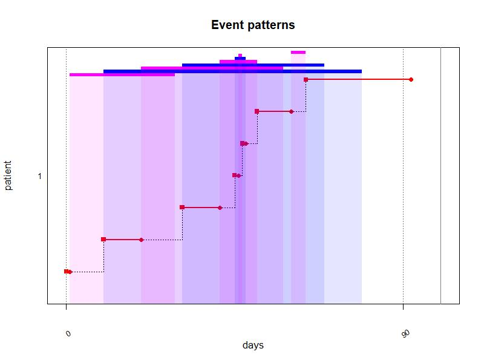
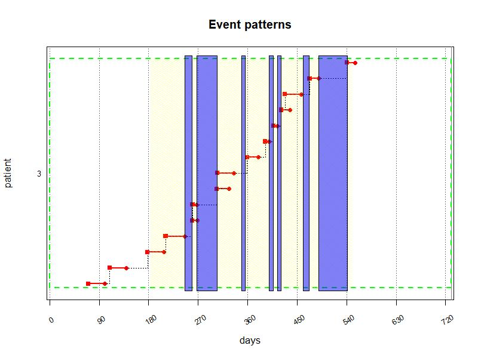

Compute event durations from different data sources
================
Samuel S. Allemann, Dan Dediu & Alex L. Dima
2019-03-25

Adherence is defined as the agreement between prescribed and actual
medication use. `AdhereR` estimates adherence based on durations for
which medications are prescribed and/or dispensed. However, medications
might not be prescribed or dispensed for a specific duration in all
circumstances. Many healthcare settings allow for multiple refills of
prescriptions, and medications might be dispensed in fixed pre-packed
quantities rather than from bulk. Moreover, various events might affect
supply durations after medications have been dispensed. Prescribed
dosage might change between dispensing events, changing the original
supply duration. Treatments may be interrupted and resumed at later
times, for which existing supplies may or may not be taken into account.
In contrast, patients might not use their own supplies during certain
periods (e.g., when hospitalised). When information about prescription
and dispensing events and treatment interruptions is available,
`AdhereR` can calculate actual supply durations, taking into account
changes during the course of treatment.

This vignette describes the function `compute_event_durations` and its
arguments. We use the provided example datasets to illustrate the
various options and their impact on the calculated durations.

## Definitions

Throughout `AdhereR`, we use the same terms and definitions. For a
complete list, you may refer to the vignette of the package. Here we
reiterate a selection of those terms and describe additional terms
relevant for the context of this function:

  - *CMA* = continuous multiple-interval measures of medication
    availability/gaps, representing various indicators of the quality of
    implementation,
  - *Medication event* = prescribing or dispensing record of a given
    medication for a given patient; usually includes the patient’s
    unique identifier, an event date, and a duration,
  - *Duration* = number of days the quantity of supplied medication
    would last if used as recommended,
  - *Quantity* = dose supplied at a medication event,
  - *Daily dosage* = dose recommended to be taken daily,
  - *Medication class* = classification performed by the researcher
    depending on study aims, e.g. based on therapeutic use, mechanism of
    action, chemical molecule or pharmaceutical formulation,
  - *Dosage change* = adjustment of the dose recommended to be taken
    daily,
  - *Initial prescription* = first prescription event recorded in the
    dataset,
  - *Prescription renewal* = subsequent prescription events after
    initial prescription,
  - *Prescription duration* = number of days for which the medication
    should be used as prescribed,
  - *Treatment interruption* = stop of prescription for a period of time
    before prescription renewal,
  - *Prescription episode* = period of prescribed use deliminated by
    start and end date of prescribed use

## Input data

`AdhereR` is designed to use datasets that have already been extracted
and prepared for processing, as described in the package vignette. To
compute event durations, at least two separate datasets are required:
*Dispensing events* and *Prescription events*. Additionally, periods for
which medication is supplied but not documented in the dispensing
dataset can be provided (e.g. *hospitalisation events*). Each of those
datasets might require specific preparation steps to bring them into the
format decribed below.

### Dispensing data

The minimum necessary dataset includes 4 variables for each dispensing
event: *patient unique identifier*, *event date*, *medication type*, and
*dispensed quantity*. *Medication type* can include multiple columns,
which allows to distinguish medications on multiple levels. For example,
one might want to differentiate between galenic forms of the same
substance (e.g., tablets and inhalers of corticosteroids) and include
both columns (substance and form) to describe *medication type*. The
*dispensed quantity* could be the number of units dispensed (e.g.,
tablets), or a total number of subunits contained in each dispensed unit
(e.g., milligrams in tablets). If multiple dosage forms for the same
substance exist, it is useful to calculate the subunits because the
dispensed dosage per unit might not correspond to the prescribed dosage
per unit. For example, a prescription for *40 mg Atorvastatin 1 tablet
daily* might be dispensed as 80 mg tablets with the instruction to use
half of a tablet per day.

For demonstration purposes, we included a sample dataset containing
dispensing events (one per row) for 16 patients over a period of roughly
24 months (1794 events in total). Each row represents an individual
dispensing record for a specific dose of a specific medication for a
patient at a given date. Six variables are included in this dataset:

  - patient unique identifier (`ID`),
  - dispensing event date (`DATE.DISP`; from 1 July 2056 to 12 July
    2058, in the “yyyy-mm-dd” ISO format),
  - medication type (`ATC.CODE`; 49 different codes according to the
    Anatomical Therapeutic Chemical Classification \[ATC\] System),
  - dosage unit (`UNIT`; 57% MG, 12% MICROG, 31% UI),
  - dosage form (`FORM`; 12% INHALATION VAPOUR, 3% INJECTION, 13%
    METERED INHALER, 72% ORAL FORM), and
  - quantity (`TOTAL.DOSE`; median 20000, range 10-120000000).

[Table 1](#Table-1) shows the first 10 rows of the dispensing events in
the example dataset `durcomp.dispensing`.

``` r
# Display head of dispensing data as pretty markdown table:
knitr::kable(head(durcomp.dispensing), caption = "<a name=\"Table-1\"></a>**Table 1:** First 10 rows of example dispensing data");
```

| ID | DATE.DISP  | ATC.CODE | UNIT | FORM      | TOTAL.DOSE |
| -: | :--------- | :------- | :--- | :-------- | ---------: |
|  1 | 2057-01-14 | A02BC05  | MG   | ORAL FORM |       1120 |
|  1 | 2057-03-07 | A02BC05  | MG   | ORAL FORM |        280 |
|  1 | 2056-10-03 | A02BC05  | MG   | ORAL FORM |       1120 |
|  1 | 2056-12-03 | A02BC05  | MG   | ORAL FORM |       1120 |
|  1 | 2057-08-04 | A02BC05  | MG   | ORAL FORM |       1120 |
|  1 | 2058-02-09 | A02BC05  | MG   | ORAL FORM |       1120 |

<a name="Table-1"></a>**Table 1:** First 10 rows of example dispensing
data

### Prescribing data

The minimum necessary dataset includes 4 variables for each prescription
event: *patient unique identifier*, *event date*, *medication type*, and
*prescribed daily dose*. A *visit number* and *prescription duration*
are optional. *Medication type* can include multiple columns,
corresponding to the columns in the *dispensing dataset*. A duration
will only be calculated if the information in all columns for the
medication type are the same in dispensing and prescription events.
Similar to the *dispensed quantity*, the *prescribed daily dose* could
be the number of units prescribed per day (e.g., 2 tablets), or a total
dosage to be taken daily (e.g., 40 mg). If a medication is prescribed
for regular but not daily use, the dosage should be recalculated,
e.g. in case of *70 mg once per week*, the *prescribed daily dose*
should be 10 mg.

For demonstration purposes, we included a sample dataset containing
prescription events (one per row) for 16 patients over a period of
roughly 15 months (1502 events in total). Each row represents an
individual prescription record for a specific dose of a specific
medication for a patient at a given date. Eight variables are included
in this dataset:

  - patient unique identifier (`ID`),
  - prescription event date (`DATE.PRESC`; from 15 September 2056 to 30
    December 2057, in the “yyyy-mm-dd” ISO format),
  - visit number (`VISIT`; median 5, range 0-16),
  - medication type (`ATC.CODE`; 43 different codes according to the
    Anatomical Therapeutic Chemical Classification \[ATC\] System),
  - dosage unit (`UNIT`; 50% MG, 10% MICROG, 40% UI),
  - dosage form (`FORM`; 18% INHALATION VAPOUR, 5% INJECTION, 13%
    METERED INHALER, 64% ORAL FORM),
  - prescription duration (`PRESC.DURATION`; median 30, range 30-90
    days, 1437 `NA`’s), and
  - prescribed daily dose (`DAILY.DOSE`; median 600, range
    0.07-8000000).

[Table 2](#Table-2) shows the first 10 rows of the prescription events
in the example dataset `durcomp.prescribing`.

``` r
# Display head of prescribing data as pretty markdown table:
knitr::kable(head(durcomp.prescribing), caption = "<a name=\"Table-2\"></a>**Table 2:** First 10 rows of example prescribing data");
```

| ID | DATE.PRESC | VISIT | ATC.CODE | FORM      | UNIT | PRESC.DURATION | DAILY.DOSE |
| -: | :--------- | ----: | :------- | :-------- | :--- | -------------: | ---------: |
|  1 | 2056-12-08 |     0 | A09AA02  | ORAL FORM | UI   |             NA |      36000 |
|  1 | 2057-02-23 |     1 | A09AA02  | ORAL FORM | UI   |             NA |      86000 |
|  1 | 2057-03-03 |     2 | A09AA02  | ORAL FORM | UI   |             NA |      86000 |
|  1 | 2057-03-18 |     3 | A09AA02  | ORAL FORM | UI   |             NA |      86000 |
|  1 | 2057-09-01 |     4 | A09AA02  | ORAL FORM | UI   |             NA |      86000 |
|  1 | 2057-09-24 |     5 | A09AA02  | ORAL FORM | UI   |             NA |      86000 |

<a name="Table-2"></a>**Table 2:** First 10 rows of example prescribing
data

### Periods of undocumented supply (optional)

During certain periods, patients may use medications from other supplies
than what is recorded in the dispensing data. Typical examples of such
periods are hospitalisations, incarcerations, or similar. If this
information is available, the necessary dataset includes 3 variables for
each unmonitored period: *patient unique identifier*, *start date*, and
*end date* of unmonitored period.

For demonstration purposes, we included a sample dataset containing
hospitalization periods (one per row) for 10 patients over a period of
roughly 18 months (28 events in total). Each row represents an
individual hospitalisation period of a patient for whom event durations
should be calculated. All column names must match the format provided in
this example:

  - patient unique identifier (`ID`),
  - start date (`DATE.IN`; from 15 September 2056 to 23 November 2057,
    in the “yyyy-mm-dd” ISO format), and
  - end date (`DATE.OUT`; from 22 September 2056 to 24 December 2057, in
    the “yyyy-mm-dd” ISO format)

[Table 3](#Table-3) shows the first 10 rows of the hospitalisation
events in the example dataset `durcomp.hospitalisation`.

``` r
# Display head of hospitalisation data as pretty markdown table:
knitr::kable(head(durcomp.hospitalisation), caption = "<a name=\"Table-3\"></a>**Table 3:** First 10 rows of example hospitalisation data");
```

| ID | DATE.IN    | DATE.OUT   |
| -: | :--------- | :--------- |
|  1 | 2057-03-03 | 2057-03-06 |
|  1 | 2057-09-01 | 2057-09-04 |
|  3 | 2057-03-04 | 2057-03-17 |
|  3 | 2057-03-26 | 2057-05-01 |
|  3 | 2057-06-15 | 2057-06-22 |
|  3 | 2057-08-04 | 2057-08-12 |

<a name="Table-3"></a>**Table 3:** First 10 rows of example
hospitalisation data

## Function arguments

The function provides various options regarding prescription start and
renewal, dosage changes, and treatment interruptions.

### Force initial prescription

If the dispensing dataset of a patient covers events with earlier dates
than the first prescription events for this specific medication,
`force.init.presc = TRUE` advances the date of the first prescritpion
event to the date of the first dispensing event. For example, if
prescribing data is only available during the observation window, but
dispensing data covers a larger follow-up window, this setting allows
the calculation of supply durations for carryover into the observation
window. However, this only has an effect when the first prescription
event is not limited in duration (as indicated in
`presc.duration.colname`). This is to make sure that existing supplies
of discontinued treatments are not carried over into the observation
window.

In the example in [Figure 1](#Figure-1) below, the patient had
dispensing events for Salbutamol (R03AC02) and Salmeterol (R03AC12)
starting from 2056-07-31, but the first prescribing event for either of
those was not before 2056-12-10. Because the prescriptions were not
limited in duration, by setting `force.init.presc = TRUE`, durations for
dispensing events before 2056-12-10 can be
calculated.

``` r
min(durcomp.dispensing[ID == 14 & grepl("R03AC", ATC.CODE), DATE.DISP])
```

    ## [1] "2056-07-31"

``` r
min(durcomp.prescribing[ID == 14 & grepl("R03AC", ATC.CODE), DATE.PRESC])
```

    ## [1] "2056-12-10"

``` r
event_durations <- compute_event_durations(disp.data = durcomp.dispensing[ID == 14 & grepl("R03AC", ATC.CODE)],
                                           presc.data = durcomp.prescribing[ID == 14 & grepl("R03AC", ATC.CODE)],
                                           hosp.data = durcomp.hospitalisation,
                                           ID.colname = "ID",
                                           presc.date.colname = "DATE.PRESC",
                                           disp.date.colname = "DATE.DISP",
                                           date.format = "%Y-%m-%d",
                                           medication.class.colnames = c("ATC.CODE","UNIT", "FORM"),
                                           total.dose.colname = "TOTAL.DOSE",
                                           presc.daily.dose.colname = "DAILY.DOSE",
                                           presc.duration.colname = "PRESC.DURATION",
                                           visit.colname = "VISIT",
                                           force.init.presc = TRUE,
                                           force.presc.renew = TRUE,
                                           split.on.dosage.change = TRUE,
                                           trt.interruption = "continue",
                                           suppress.warnings = FALSE,
                                           return.data.table = TRUE);
```

    ## 
      |                                                                       
      |                                                                 |   0%

``` r
cma7 <- CMA7(event_durations[DURATION > 0],
             ID.colname = "ID",
             event.date.colname = "DISP.START",
             event.duration.colname = "DURATION",
             event.daily.dose.colname = "DAILY.DOSE",
             medication.class.colname = "ATC.CODE",
             carry.only.for.same.medication = FALSE,
             followup.window.start = as.Date("2056-07-31"),
             followup.window.duration = 2*365,
             observation.window.start = as.Date("2057-01-01"),
             observation.window.duration = 365)

plot(cma7, min.plot.size.in.characters.vert = 0)
```


### Force prescription renewal

If a medication is not prescribed during any given prescription event
for a patient, `force.prescription.renew = TRUE` will make sure that the
prescription episode for this medication ends on the first visit without
renewal. Alternatively, this can be set for each medication class
separately by providing the name of a column containing the information
in the dispensing dataset (logical, `TRUE`or `FALSE`).

If prescriptions are not routinely prescribed during all visits,
`force.prescription.renew` should be set to `FALSE`. This can also be
the case if prescription data covers multiple prescribers, because
treatments prescribed by one prescriber might continue even when not
prescribed during a subsequent visit to another prescriber.

In [Table 4](#Table-4) and [Figure 2](#Figure-2) below, the medication
(a leukotriene receptor antagonist) was prescribed for a limited
duration initially (during visit 2 and 3). Later, it was represcribed
during visits 7, 8, 10, and 11, but not during visit 9. By setting
`force.presc.renew = TRUE`, the prescription ends on the date of visit 9
and restarts on the date of visit 10.

``` r
# Display example of prescription data as pretty markdown table:
knitr::kable(durcomp.prescribing[ID == 9 & grepl("R03DC03", ATC.CODE)], caption = "<a name=\"Table-4\"></a>**Table 4:** Prescription events for example patient.");
```

| ID | DATE.PRESC | VISIT | ATC.CODE | FORM      | UNIT | PRESC.DURATION | DAILY.DOSE |
| -: | :--------- | ----: | :------- | :-------- | :--- | -------------: | ---------: |
|  9 | 2057-01-27 |     2 | R03DC03  | ORAL FORM | MG   |             NA |         10 |
|  9 | 2057-02-10 |     3 | R03DC03  | ORAL FORM | MG   |             30 |         10 |
|  9 | 2057-08-28 |     7 | R03DC03  | ORAL FORM | MG   |             NA |         10 |
|  9 | 2057-09-18 |     8 | R03DC03  | ORAL FORM | MG   |             NA |         10 |
|  9 | 2057-10-30 |    10 | R03DC03  | ORAL FORM | MG   |             NA |         10 |
|  9 | 2057-11-13 |    11 | R03DC03  | ORAL FORM | MG   |             NA |         10 |

<a name="Table-4"></a>**Table 4:** Prescription events for example
patient.

``` r
# cumpute event durations for all medications for a patient to cover all visits
event_durations <- compute_event_durations(disp.data = durcomp.dispensing[ID == 9],
                                           presc.data = durcomp.prescribing[ID == 9],
                                           hosp.data = durcomp.hospitalisation,
                                           ID.colname = "ID",
                                           presc.date.colname = "DATE.PRESC",
                                           disp.date.colname = "DATE.DISP",
                                           date.format = "%Y-%m-%d",
                                           medication.class.colnames = c("ATC.CODE","UNIT", "FORM"),
                                           total.dose.colname = "TOTAL.DOSE",
                                           presc.daily.dose.colname = "DAILY.DOSE",
                                           presc.duration.colname = "PRESC.DURATION",
                                           visit.colname = "VISIT",
                                           force.init.presc = TRUE,
                                           force.presc.renew = TRUE,
                                           split.on.dosage.change = FALSE,
                                           trt.interruption = "continue",
                                           suppress.warnings = FALSE,
                                           return.data.table = TRUE);
```

    ## 
      |                                                                       
      |                                                                 |   0%

``` r
# subset to events with duration > 0 and medication of interest
event_durations <- event_durations[DURATION > 0 & grepl("R03DC03", ATC.CODE)]

# compute CMA0
cma0 <- CMA0(event_durations,
             ID.colname = "ID",
             event.date.colname = "DISP.START",
             event.duration.colname = "DURATION",
             event.daily.dose.colname = "DAILY.DOSE",
             medication.class.colname = "ATC.CODE",
             followup.window.start = as.Date("2057-01-01"),
             followup.window.duration = 365,
             observation.window.start = as.Date("2057-01-01"),
             observation.window.duration = 365)

# construc treatment episodes
TEs <- unique(event_durations[,.(START.PRESC, END.PRESC, DAILY.DOSE)])
TEs[is.na(END.PRESC), END.PRESC := as.Date("2057-12-31")] #set end date for last episode
TEs <- na.omit(TEs) #omit TEs with NA

# add row indices
event_durations[,I := .I]

# plot CMA0
plot(cma0, min.plot.size.in.characters.vert = 0, show.legend = FALSE)
# add treatment episodes
for(i in 1:nrow(TEs)){
  bottom = head(event_durations[,I],1)
  top = tail(event_durations[,I],1)
  start = as.numeric(TEs[i, "START.PRESC"]-head(TEs[,"START.PRESC"],1)) + 26
  end = as.numeric(TEs[i, "END.PRESC"]-head(TEs[, "START.PRESC"],1)) + 26
  offset = min(TEs[["START.PRESC"]], na.rm = TRUE)-min(event_durations[["DISP.START"]], na.rm = TRUE)

  rect(xleft=start+offset, xright=end+offset, ybottom=bottom-0.45, ytop=top+0.45, col = rgb(1,1,0,alpha = 0.2), border = "black", lty = "dashed", lwd = 0.1)}
```



### Split on dosage change

If the dosage changes before the end of a supply duration,
`split.on.dosage.change = TRUE` creates a new event on the day of dosage
change and recalculates the duration for the remaining supply. If
patients are expected to finish the previous supply with the original
dose and starting with the new dosage recommendation from the next
supply onward, `split.on.dosage.change` should be set to `FALSE`.
Alternatively, this can be set for each medication class separately by
providing the name of a column containing the information in the
dispensing dataset (logical, `TRUE`or `FALSE`).

In [Figure 3](#Figure-3) below, the dosage for Insulin (NovoMix) changed
while the patient still had an available supply. By setting
`split.on.dosage.change = TRUE`, a new event is created on the day of
dosage change (blue vertical
lines).

``` r
event_durations <- compute_event_durations(disp.data = durcomp.dispensing[ID == 7 & grepl("A10AB", ATC.CODE)],
                                           presc.data = durcomp.prescribing[ID == 7 & grepl("A10AB", ATC.CODE)],
                                           hosp.data = durcomp.hospitalisation,
                                           ID.colname = "ID",
                                           presc.date.colname = "DATE.PRESC",
                                           disp.date.colname = "DATE.DISP",
                                           date.format = "%Y-%m-%d",
                                           medication.class.colnames = c("ATC.CODE","UNIT", "FORM"),
                                           total.dose.colname = "TOTAL.DOSE",
                                           presc.daily.dose.colname = "DAILY.DOSE",
                                           presc.duration.colname = "PRESC.DURATION",
                                           visit.colname = "VISIT",
                                           force.init.presc = TRUE,
                                           force.presc.renew = TRUE,
                                           split.on.dosage.change = TRUE,
                                           trt.interruption = "continue",
                                           suppress.warnings = FALSE,
                                           return.data.table = TRUE);
```

    ## 
      |                                                                       
      |                                                                 |   0%

``` r
cma0 <- CMA0(event_durations[DURATION > 0],
             ID.colname = "ID",
             event.date.colname = "DISP.START",
             event.duration.colname = "DURATION",
             event.daily.dose.colname = "DAILY.DOSE",
             medication.class.colname = "ATC.CODE",
             followup.window.start = as.Date("2056-07-01"),
             followup.window.duration = 2*365,
             observation.window.start = as.Date("2057-01-01"),
             observation.window.duration = 365)

event_durations[DURATION > 0, I := .I]

dosage.changes <- event_durations[DISP.START != DATE.DISP, .(days = as.numeric(DISP.START-as.Date("2056-07-01")),
                                                             I = I)]

plot(cma0, min.plot.size.in.characters.vert = 0,print.dose = TRUE)
segments(x0 = dosage.changes$days, y0 = dosage.changes$I, y1 = dosage.changes$I-1, lwd = 2, col = "blue")
```


### Undocumented supply and treatment interruptions

In case of periods of undocumented supply (e.g., hospitalizations) or
treatment interruptions, `trt.interruption` can be set to tell AdhereR
what to do with remaining supply at the start of such periods. There are
3 options: - *continue* has no impact on durations and dispensing start
dates: Patients are expected to continue using the existing supply as
initially prescribed, - *discard* truncates supplies at the beginning of
an undocumented supply period or treatment interruption and the
remaining supply is discarded. This might be used if patients are asked
to return unused medications after a limited treatment course
(e.g. antibiotic treatments), and - *carryover* truncates supplies at
the beginning of an undocumented supply period or treatment
interruption, but the remaining supply is carried over until the end of
the interruption and a new event will added for the remaining duration.
This might be used if patients are hospitalized where they receive
medications from hospital wards, but are expected to continue using
their previously available supplies. Similarly, if patients have repeat
prescriptions for short durations and are expected to use supplies from
previous courses. **CAVE** It is currently not possible to consider the
undocumented supply periods or treatment interruptions when calculating
CMAs with `AdhereR`. This should be possible in the future, but if
required at the moment, these periods have to be removed manually.

In [Figure 4](#Figure-4) below, the patient had frequent hospitalisation
events (blue segments). By setting `trt.interruptions = "carryover"`,
supplies available before the start of hospitalisation are truncated and
a new event is created on the day of discharge for the remaining
supply.

``` r
event_durations <- compute_event_durations(disp.data = durcomp.dispensing[ID == 3 & grepl("J01EE01", ATC.CODE)],
                                           presc.data = durcomp.prescribing[ID == 3 & grepl("J01EE01", ATC.CODE)],
                                           hosp.data = durcomp.hospitalisation,
                                           ID.colname = "ID",
                                           presc.date.colname = "DATE.PRESC",
                                           disp.date.colname = "DATE.DISP",
                                           date.format = "%Y-%m-%d",
                                           medication.class.colnames = c("ATC.CODE","UNIT", "FORM"),
                                           total.dose.colname = "TOTAL.DOSE",
                                           presc.daily.dose.colname = "DAILY.DOSE",
                                           presc.duration.colname = "PRESC.DURATION",
                                           visit.colname = "VISIT",
                                           force.init.presc = TRUE,
                                           force.presc.renew = TRUE,
                                           split.on.dosage.change = TRUE,
                                           trt.interruption = "carryover",
                                           suppress.warnings = FALSE,
                                           return.data.table = TRUE);
```

    ## 
      |                                                                       
      |                                                                 |   0%

``` r
event_durations <- event_durations[DURATION > 0]

cma0 <- CMA0(event_durations,
             ID.colname = "ID",
             event.date.colname = "DISP.START",
             event.duration.colname = "DURATION",
             event.daily.dose.colname = "DAILY.DOSE",
             medication.class.colname = "ATC.CODE",
             followup.window.start = as.Date("2056-07-01"),
             followup.window.duration = 2*365,
             observation.window.start = as.Date("2057-01-01"),
             observation.window.duration = 365)

event_durations[,I := .I]

plot(cma0, min.plot.size.in.characters.vert = 0, show.legend = FALSE)
for(i in 1:nrow(durcomp.hospitalisation[ID == 3])){

  first_event <- as.Date("2056-07-01")

  bottom = head(event_durations[,I],1)
  top = tail(event_durations[,I],1)
  start = as.numeric(durcomp.hospitalisation[ID == 3][[i, "DATE.IN"]]-first_event)
  end = as.numeric(durcomp.hospitalisation[ID == 3][[i, "DATE.OUT"]]-first_event)

  rect(xleft=start, xright=end, ybottom=bottom-0.45, ytop=top+0.45, col = rgb(0,0,1,alpha = 0.5), border = NULL)}
```



## Output values

The output of `copute_event_durations` contains all data required for
CMA computations, plus additional information for other purposes:

  - `ID.colname`: the unique patient ID, as given by the `ID.colname`
    parameter.
  - `medication.class.colnames`: the column(s) with classes/types/groups
    of medication, as given by the `medication.class.colnames`
    parameter.
  - `total.dose.colname`: the total dispensed quantity, as given by the
    `total.dose.colname` parameter.
  - `disp.date.colname`: the date of the dispensing event, as given by
    the `disp.date.colnema` parameter.
  - `DISP.START`: the start date of the dispensing event, either the
    same as in `disp.date.colnema` or a later date in case of dosage
    changes or treatment interruptions/hospitalisations.
  - `presc.daily.dose.colname`: the prescribed daily dose, as given by
    the `presc.daily.dose.colname` parameter.
  - `DURATION`: the calculated duration of the supply, based on the
    total dispensed dose and the prescribed daily dose, starting from
    the `DISP.START` date.
  - `START.PRESC`: the start date of the prescription episode.
  - `END.PRESC`: the end date of the prescription episode.
  - `HOSP.DURATION`: the number of days during the current supply period
    affected by hospitalizations (only if `trt.interruption =
    "continue"`).
  - `tot.presc.interruptions`: the total number of prescription
    interruptions per patient for a specific medication.
  - `tot.dosage.changes`: the total number of dosage changes per patient
    for a specific medication.

<!-- end list -->

``` r
setkey(durcomp.dispensing, ID, ATC.CODE)
setkey(durcomp.prescribing, ID, ATC.CODE)

durcomp.prescribing[,.(DATE.PRESC = min(DATE.PRESC), PRESC.DURATION = PRESC.DURATION), by = .(ID, ATC.CODE)][durcomp.dispensing[,.(DATE.DISP = min(DATE.DISP)), by = .(ID, ATC.CODE)], on = .(ID, ATC.CODE)][DATE.PRESC > DATE.DISP & !is.na(PRESC.DURATION)]
```

    ##     ID ATC.CODE DATE.PRESC PRESC.DURATION  DATE.DISP
    ##  1:  4  J01CR02 2057-07-15             30 2056-12-16
    ##  2:  4  J01GB01 2056-12-16             30 2056-07-01
    ##  3:  4  J01MA02 2057-05-26             30 2056-12-16
    ##  4:  4  J01MA02 2057-05-26             30 2056-12-16
    ##  5:  5  J01EE01 2057-02-23             30 2056-12-15
    ##  6:  5  R03BA05 2056-11-03             60 2056-10-04
    ##  7:  6  J01EE01 2057-01-16             30 2056-10-02
    ##  8:  6  J01EE01 2057-01-16             30 2056-10-02
    ##  9:  7  J01EE01 2057-12-10             30 2056-07-28
    ## 10:  7  J01MA02 2057-04-15             30 2056-11-19
    ## 11:  7  J01MA02 2057-04-15             30 2056-11-19
    ## 12:  7  J01MA02 2057-04-15             30 2056-11-19
    ## 13:  7  J01MA02 2057-04-15             30 2056-11-19
    ## 14:  7  J01MA02 2057-04-15             30 2056-11-19
    ## 15:  8  J01DC02 2057-02-18             30 2056-07-15
    ## 16:  8  J01MA12 2057-02-18             30 2056-07-15
    ## 17:  9  J01EE01 2057-01-07             30 2056-09-18
    ## 18:  9  J01EE01 2057-01-07             30 2056-09-18
    ## 19:  9  J01MA02 2057-01-07             30 2056-09-18
    ## 20:  9  J01MA02 2057-01-07             30 2056-09-18
    ## 21:  9  J01MA02 2057-01-07             30 2056-09-18
    ## 22:  9  R03DC03 2057-01-27             30 2056-09-11
    ## 23: 10  J01EE01 2057-01-06             30 2056-08-21
    ## 24: 10  J01EE01 2057-01-06             30 2056-08-21
    ## 25: 10  J01EE01 2057-01-06             30 2056-08-21
    ## 26: 10  J01EE01 2057-01-06             30 2056-08-21
    ## 27: 10  J01MA02 2057-01-06             30 2056-08-21
    ## 28: 10  J01MA02 2057-01-06             30 2056-08-21
    ## 29: 10  J01MA02 2057-01-06             30 2056-08-21
    ## 30: 10  J01MA02 2057-01-06             30 2056-08-21
    ## 31: 11  J01EE01 2057-10-19             30 2056-09-24
    ## 32: 11  J01MA02 2057-10-19             30 2056-09-24
    ## 33: 13  J01EE01 2056-12-12             30 2056-09-12
    ## 34: 13  J01EE01 2056-12-12             30 2056-09-12
    ## 35: 13  J01MA02 2057-03-18             30 2056-07-25
    ## 36: 13  J01MA02 2057-03-18             30 2056-07-25
    ## 37: 14  J01DF01 2056-12-10             30 2056-07-02
    ## 38: 14  J01DF01 2056-12-10             30 2056-07-02
    ## 39: 14  J01EE01 2057-02-28             30 2056-07-31
    ## 40: 14  J01MA02 2057-09-16             30 2057-09-14
    ## 41: 15  J01FG01 2057-02-02             30 2056-10-06
    ## 42: 15  J01FG01 2057-02-02             30 2056-10-06
    ## 43: 15  J01FG01 2057-02-02             30 2056-10-06
    ## 44: 15  J01FG01 2057-02-02             30 2056-10-06
    ## 45: 16  J01DD13 2057-06-09             30 2056-11-17
    ## 46: 16  J01DD13 2057-06-09             30 2056-11-17
    ## 47: 16  J01EE01 2057-09-22             30 2056-07-10
    ## 48: 16  J01EE01 2057-09-22             30 2056-07-10
    ## 49: 16  J01EE01 2057-09-22             30 2056-07-10
    ##     ID ATC.CODE DATE.PRESC PRESC.DURATION  DATE.DISP

``` r
event_durations <- compute_event_durations(disp.data = durcomp.dispensing[ID == 6 & ATC.CODE == "J01XB01"],
                                           presc.data = durcomp.prescribing[ID == 6 & ATC.CODE == "J01XB01"],
                                           hosp.data = durcomp.hospitalisation,
                                           ID.colname = "ID",
                                           presc.date.colname = "DATE.PRESC",
                                           disp.date.colname = "DATE.DISP",
                                           date.format = "%Y-%m-%d",
                                           medication.class.colnames = c("ATC.CODE",
                                                                         "UNIT", "FORM"),
                                           total.dose.colname = "TOTAL.DOSE",
                                           presc.daily.dose.colname = "DAILY.DOSE",
                                           presc.duration.colname = "PRESC.DURATION",
                                           visit.colname = "VISIT",
                                           force.init.presc = TRUE,
                                           force.presc.renew = TRUE,
                                           split.on.dosage.change = TRUE,
                                           trt.interruption = "continue",
                                           suppress.warnings = FALSE,
                                           return.data.table = TRUE);
```

    ## 
      |                                                                       
      |                                                                 |   0%

``` r
cma0 <- CMA0(event_durations[DURATION > 0],
             ID.colname = "ID",
             event.date.colname = "DISP.START",
             event.duration.colname = "DURATION",
             event.daily.dose.colname = "DAILY.DOSE",
             medication.class.colname = "ATC.CODE")
```
