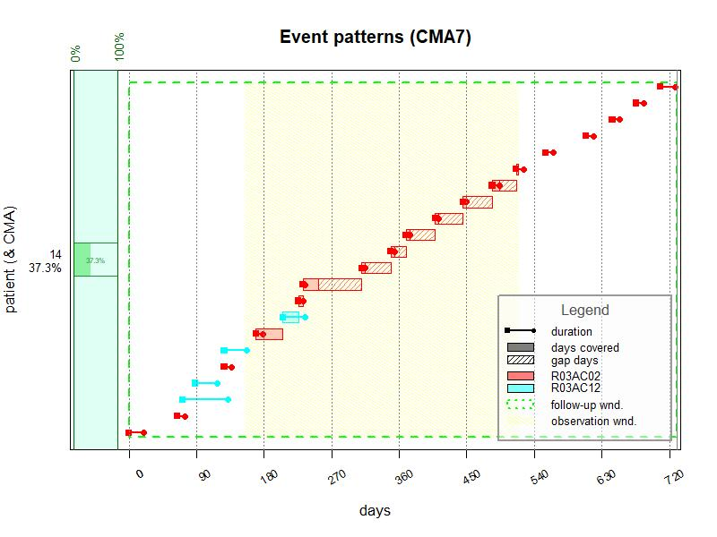
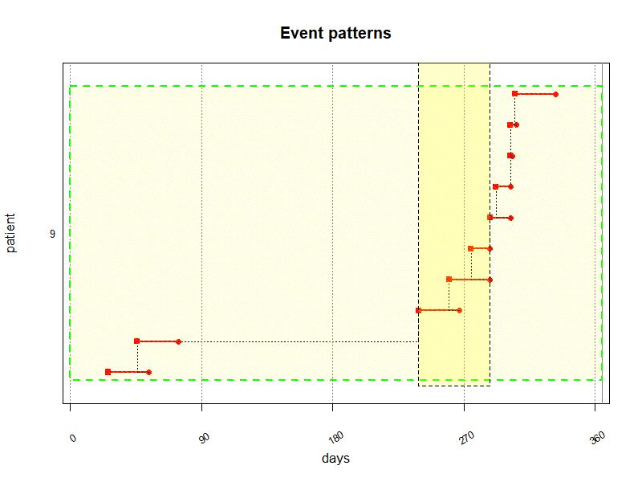
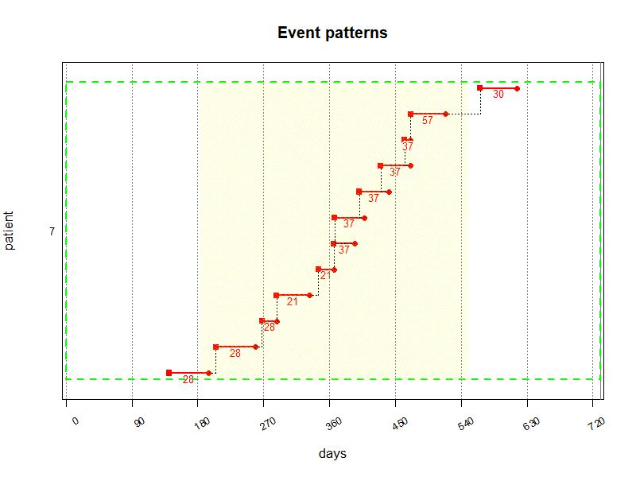
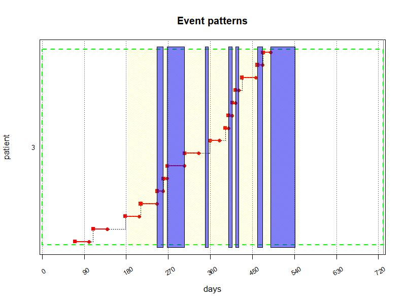

Compute event durations from different data sources
================
Samuel S. Allemann, Dan Dediu & Alex L. Dima
2019-04-16

Adherence is defined as the agreement between prescribed and actual
medication use. `AdhereR` estimates adherence based on durations for
which medications are prescribed and/or dispensed. However, medications
might not be prescribed or dispensed for a specific duration in all
circumstances. Many healthcare settings allow for multiple refills of
prescriptions, and medications might be dispensed in fixed pre-packed
quantities rather than from bulk. Moreover, various events might affect
supply durations after medications have been dispensed. Prescribed
dosage might change between dispensing events, changing the original
supply duration. Treatments may be interrupted and resumed at later
times, for which existing supplies may or may not be taken into account.
In contrast, patients might not use their own supplies during certain
periods (e.g., when hospitalised). When information about prescription
and dispensing events and treatment interruptions is available,
`AdhereR` can calculate actual supply durations, taking into account
changes during the course of treatment.

This vignette describes the function `compute_event_durations` and its
arguments. We use the provided example datasets to illustrate the
various options and their impact on the calculated durations.

## Definitions

Throughout `AdhereR`, we use the same terms and definitions. For a
complete list, you may refer to the vignette of the package. Here we
reiterate a selection of those terms and describe additional terms
relevant for the context of this function:

  - *CMA* = continuous multiple-interval measures of medication
    availability/gaps, representing various indicators of the quality of
    implementation,
  - *Medication event* = prescribing or dispensing record of a given
    medication for a given patient; usually includes the patient’s
    unique identifier, an event date, and a duration,
  - *Duration* = number of days the quantity of supplied medication
    would last if used as recommended,
  - *Quantity* = dose supplied at a medication event,
  - *Daily dosage* = dose recommended to be taken daily,
  - *Medication class* = classification performed by the researcher
    depending on study aims, e.g. based on therapeutic use, mechanism of
    action, chemical molecule or pharmaceutical formulation,
  - *Dosage change* = adjustment of the dose recommended to be taken
    daily,
  - *Initial prescription* = first prescription event recorded in the
    dataset,
  - *Prescription renewal* = subsequent prescription events after
    initial prescription,
  - *Prescription duration* = number of days for which the medication
    should be used as prescribed,
  - *Treatment interruption* = stop of prescription for a period of time
    before prescription renewal,
  - *Prescription episode* = period of prescribed use deliminated by
    start and end date of prescribed use

## Input data

`AdhereR` is designed to use datasets that have already been extracted
and prepared for processing, as described in the package vignette. To
compute event durations, at least two separate datasets are required:
*Dispensing events* and *Prescription events*. Additionally, periods for
which medication is supplied but not documented in the dispensing
dataset can be provided (e.g. *hospitalisation events*). Each of those
datasets might require specific preparation steps to bring them into the
format decribed below.

### Dispensing data

The minimum necessary dataset includes 4 variables for each dispensing
event: *patient unique identifier*, *event date*, *medication type*, and
*dispensed quantity*. *Medication type* can include multiple columns,
which allows to distinguish medications on multiple levels. For example,
one might want to differentiate between galenic forms of the same
substance (e.g., tablets and inhalers of corticosteroids) and include
both columns (substance and form) to describe *medication type*. The
*dispensed quantity* could be the number of units dispensed (e.g.,
tablets), or a total number of subunits contained in each dispensed unit
(e.g., milligrams in tablets). If multiple dosage forms for the same
substance exist, it is useful to calculate the subunits because the
dispensed dosage per unit might not correspond to the prescribed dosage
per unit. For example, a prescription for *40 mg Atorvastatin 1 tablet
daily* might be dispensed as 80 mg tablets with the instruction to use
half of a tablet per day.

For demonstration purposes, we included a sample dataset containing
dispensing events (one per row) for 16 patients over a period of roughly
24 months (1794 events in total). Each row represents an individual
dispensing record for a specific dose of a specific medication for a
patient at a given date. Six variables are included in this dataset:

  - patient unique identifier (`ID`),
  - dispensing event date (`DATE.DISP`; from 1 July 2056 to 12 July
    2058, in the “yyyy-mm-dd” ISO format),
  - medication type (`ATC.CODE`; 49 different codes according to the
    Anatomical Therapeutic Chemical Classification \[ATC\] System),
  - dosage unit (`UNIT`; 57% MG, 12% MICROG, 31% UI),
  - dosage form (`FORM`; 12% INHALATION VAPOUR, 3% INJECTION, 13%
    METERED INHALER, 72% ORAL FORM), and
  - quantity (`TOTAL.DOSE`; median 20000, range 10-120000000).

[Table 1](#Table-1) shows the first 10 rows of the dispensing events in
the example dataset `durcomp.dispensing`.

| ID | DATE.DISP  | ATC.CODE | UNIT | FORM      | TOTAL.DOSE |
| -: | :--------- | :------- | :--- | :-------- | ---------: |
|  1 | 2057-01-14 | A02BC05  | MG   | ORAL FORM |       1120 |
|  1 | 2057-03-07 | A02BC05  | MG   | ORAL FORM |        280 |
|  1 | 2056-10-03 | A02BC05  | MG   | ORAL FORM |       1120 |
|  1 | 2056-12-03 | A02BC05  | MG   | ORAL FORM |       1120 |
|  1 | 2057-08-04 | A02BC05  | MG   | ORAL FORM |       1120 |
|  1 | 2058-02-09 | A02BC05  | MG   | ORAL FORM |       1120 |

<a name="Table-1"></a>**Table 1:** First 10 rows of example dispensing
data

### Prescribing data

The minimum necessary dataset includes 4 variables for each prescription
event: *patient unique identifier*, *event date*, *medication type*, and
*prescribed daily dose*. A *visit number* and *prescription duration*
are optional. *Medication type* can include multiple columns,
corresponding to the columns in the *dispensing dataset*. A duration
will only be calculated if the information in all columns for the
medication type are the same in dispensing and prescription events.
Similar to the *dispensed quantity*, the *prescribed daily dose* could
be the number of units prescribed per day (e.g., 2 tablets), or a total
dosage to be taken daily (e.g., 40 mg). If a medication is prescribed
for regular but not daily use, the dosage should be recalculated,
e.g. in case of *70 mg once per week*, the *prescribed daily dose*
should be 10 mg. **Important to note:** It is assumed that the
prescribed daily dose can be accomodated with the dispensed medication.
This requires careful consideration and exploratory analysis of the
dispensed and prescribed dosage forms and posologies.

For demonstration purposes, we included a sample dataset containing
prescription events (one per row) for 16 patients over a period of
roughly 15 months (1502 events in total). Each row represents an
individual prescription record for a specific dose of a specific
medication for a patient at a given date. Eight variables are included
in this dataset:

  - patient unique identifier (`ID`),
  - prescription event date (`DATE.PRESC`; from 15 September 2056 to 30
    December 2057, in the “yyyy-mm-dd” ISO format),
  - visit number (`VISIT`; median 5, range 0-16),
  - medication type (`ATC.CODE`; 43 different codes according to the
    Anatomical Therapeutic Chemical Classification \[ATC\] System),
  - dosage unit (`UNIT`; 50% MG, 10% MICROG, 40% UI),
  - dosage form (`FORM`; 18% INHALATION VAPOUR, 5% INJECTION, 13%
    METERED INHALER, 64% ORAL FORM),
  - prescription duration (`PRESC.DURATION`; median 30, range 30-90
    days, 1437 `NA`’s), and
  - prescribed daily dose (`DAILY.DOSE`; median 600, range
    0.07-8000000).

[Table 2](#Table-2) shows the first 10 rows of the prescription events
in the example dataset
`durcomp.prescribing`.

| ID | DATE.PRESC | VISIT | ATC.CODE | FORM      | UNIT | PRESC.DURATION | DAILY.DOSE |
| -: | :--------- | ----: | :------- | :-------- | :--- | -------------: | ---------: |
|  1 | 2056-12-08 |     0 | A09AA02  | ORAL FORM | UI   |             NA |      36000 |
|  1 | 2057-02-23 |     1 | A09AA02  | ORAL FORM | UI   |             NA |      86000 |
|  1 | 2057-03-03 |     2 | A09AA02  | ORAL FORM | UI   |             NA |      86000 |
|  1 | 2057-03-18 |     3 | A09AA02  | ORAL FORM | UI   |             NA |      86000 |
|  1 | 2057-09-01 |     4 | A09AA02  | ORAL FORM | UI   |             NA |      86000 |
|  1 | 2057-09-24 |     5 | A09AA02  | ORAL FORM | UI   |             NA |      86000 |

<a name="Table-2"></a>**Table 2:** First 10 rows of example prescribing
data

### Special periods (optional)

During certain periods, medication use may differ from what is expected
based on the available data. Typical examples of such periods are
hospitalisations, holidays, incarcerations, or similar. If available,
these periods can be taken into account during computation of durations.
The minimum required information are: *patient unique identifier*,
*start date*, and *end date* of special periods. Optional columns are
*type* (indicating the type of special situation), *customized
instructions* how to handle a specific period, and *medication class*
(from those specified in dispensing and prescription datasets).

For demonstration purposes, `AdhereR` uses a sample dataset containing
hospitalization periods (one per row) for 10 patients over a period of
roughly 18 months (28 events in total). Each row represents an
individual hospitalisation period of a patient for whom event durations
should be calculated. All column names must match the format provided in
this example:

  - patient unique identifier (`ID`),
  - start date (`DATE.IN`; from 15 September 2056 to 23 November 2057,
    in the “yyyy-mm-dd” ISO format), and
  - end date (`DATE.OUT`; from 22 September 2056 to 24 December 2057, in
    the “yyyy-mm-dd” ISO format)

[Table 3](#Table-3) shows the first 10 rows of the hospitalisation
events in the example dataset `durcomp.hospitalisation`.

| ID | DATE.IN    | DATE.OUT   |
| -: | :--------- | :--------- |
|  1 | 2057-03-03 | 2057-03-06 |
|  1 | 2057-09-01 | 2057-09-04 |
|  3 | 2057-03-04 | 2057-03-17 |
|  3 | 2057-03-26 | 2057-05-01 |
|  3 | 2057-06-15 | 2057-06-22 |
|  3 | 2057-08-04 | 2057-08-12 |

<a name="Table-3"></a>**Table 3:** First 10 rows of example
hospitalisation data

## Function arguments

The function provides various options regarding prescription start and
renewal, dosage changes, and treatment interruptions.

### Special periods mapping and treatment interruptions

During special periods and treatment interruptions, medication use may
differ from daily life. `special.periods.mapping` tells `AdhereR` what
to do during such periods. Similarly, `trt.interruption` specifies
handling of treatment interruptions (periods without prescription).
There are 4 options that can be set globally: - *continue* has no impact
on durations and dispensing start dates: Patients are expected to
continue using the existing supply as initially prescribed, - *discard*
truncates supplies at the beginning of special period or treatment
interruption and the remaining supply is discarded. This might be used
if patients are asked to return unused medications after a limited
treatment course (e.g. antibiotic treatments), - *carryover* truncates
supplies at the beginning of a special period or treatment interruption,
but the remaining supply is carried over until the end of the
interruption and a new event will added for the remaining duration. This
might be used if patients are hospitalized where they receive
medications from hospital wards, but are expected to continue using
their previously available supplies after discharge. Similarly, if
patients have repeat prescriptions for short durations and are expected
to use supplies from previous courses. **CAVE: When using this setting,
the computed durations may need additional processing before CMA
calculations (see examples below).**

In addition to the global options, both settings accept a column name in
the dispensing dataset (for `trt.interruption`) or special periods
dataset (for `special.periods.mapping`). The column can contain either
of *continue*, *discard*, or *carryover* per medication type (for
`trt.interruption`) or per special period type and/or medication type
(for `special.periods.mapping`).

Special periods may occur during prescription episodes or treatment
interruptions and different types of special periods may co-occur.
Treatment interrupstions are prioritized over other special periods: If
a prescription ends and `trt.interruption = 'carryover'`, a different
setting in `special.periods.mapping` has no effect during periods of
treatment interruption. However, if a special period of type *continue*
overlaps with another special period of type *carryover*, the setting of
the period with the later start date is used.

In [Figure 1](#Figure-1) below, the patient had frequent hospitalisation
events (blue segments). By setting `trt.interruptions = "carryover"`,
supplies available before the start of hospitalisation are truncated and
a new event is created on the day of discharge for the remaining supply.

``` r
# select medication class of interest and compute event durations
event_durations_list <- compute_event_durations(disp.data = durcomp.dispensing[ID == 3 & grepl("J01EE01", ATC.CODE)],
                                           presc.data = durcomp.prescribing[ID == 3 & grepl("J01EE01", ATC.CODE)],
                                           special.periods.data = durcomp.hospitalisation,
                                           special.periods.mapping = "carryover",
                                           ID.colname = "ID",
                                           presc.date.colname = "DATE.PRESC",
                                           disp.date.colname = "DATE.DISP",
                                           date.format = "%Y-%m-%d",
                                           medication.class.colnames = c("ATC.CODE","UNIT", "FORM"),
                                           total.dose.colname = "TOTAL.DOSE",
                                           presc.daily.dose.colname = "DAILY.DOSE",
                                           presc.duration.colname = "PRESC.DURATION",
                                           visit.colname = "VISIT",
                                           force.init.presc = TRUE,
                                           force.presc.renew = TRUE,
                                           split.on.dosage.change = TRUE,
                                           trt.interruption = "carryover",
                                           suppress.warnings = FALSE,
                                           return.data.table = TRUE,
                                           progress.bar = FALSE);

event_durations <- event_durations_list$event_durations

event_durations <- event_durations[DURATION > 0]

cma0 <- CMA0(event_durations,
             ID.colname = "ID",
             event.date.colname = "DISP.START",
             event.duration.colname = "DURATION",
             event.daily.dose.colname = "DAILY.DOSE",
             medication.class.colname = "ATC.CODE",
             followup.window.start = as.Date("2056-07-01"),
             followup.window.duration = 2*365,
             observation.window.start = as.Date("2057-01-01"),
             observation.window.duration = 365)

event_durations[,I := .I]

plot(cma0, min.plot.size.in.characters.vert = 0, show.legend = FALSE)
for(i in 1:nrow(durcomp.hospitalisation[ID == 3])){

  first_event <- as.Date("2056-07-01")

  bottom = head(event_durations[,I],1)
  top = tail(event_durations[,I],1)
  start = as.numeric(durcomp.hospitalisation[ID == 3][[i, "DATE.IN"]]-first_event)
  end = as.numeric(durcomp.hospitalisation[ID == 3][[i, "DATE.OUT"]]-first_event)

  rect(xleft=start, xright=end, ybottom=bottom-0.45, ytop=top+0.45, col = rgb(0,0,1,alpha = 0.5), border = NULL)}
```


Let’s consider a hypothetical scenario with a lot of overlapping special
periods:

| ID | DATE.IN    | DATE.OUT   | TYPE    | CUSTOM    |
| -: | :--------- | :--------- | :------ | :-------- |
|  1 | 2000-01-02 | 2000-01-30 | HOSP    | carryover |
|  1 | 2000-01-11 | 2000-03-20 | HOLIDAY | continue  |
|  1 | 2000-01-21 | 2000-02-28 | HOSP    | carryover |
|  1 | 2000-02-01 | 2000-03-10 | HOSP    | continue  |
|  1 | 2000-02-11 | 2000-02-21 | REHAB   | carryover |
|  1 | 2000-02-15 | 2000-02-18 | HOLIDAY | continue  |
|  1 | 2000-02-16 | 2000-02-17 | REHAB   | carryover |
|  1 | 2000-03-01 | 2000-03-05 | HOSP    | carryover |

[Figure 2](#Figure-2) shows a hypothetical patient with one prescription
and one dispensing event for 60 days. By providing the the above dataset
as `special.periods = "special_episodes"` and setting
`special.periods.mapping = "CUSTOM"`, the 60-day supply is truncated and
restarted according to the most recent special period that hasn’t ended
yet.

``` r
disp.data = data.table(ID = c(1),
                       ATC = c("A01"),
                       DATE.DISP = c("2000-01-01"),
                       TOTAL.DOSE = c(60))

presc.data = data.table(ID = c(1),
                        ATC = c("A01"),
                        DATE.PRESC = c("2000-01-01"),
                        PRESC.DOSE = c(1),
                        PRESC.DURATION = c(NA))

# compute event durations
event_durations_list <- compute_event_durations(disp.data = disp.data,
                                           presc.data = presc.data,
                                           special.periods.data = special_episodes,
                                           special.periods.mapping = "CUSTOM",
                                           ID.colname = "ID",
                                           presc.date.colname = "DATE.PRESC",
                                           disp.date.colname = "DATE.DISP",
                                           date.format = "%Y-%m-%d",
                                           medication.class.colnames = "ATC",
                                           total.dose.colname = "TOTAL.DOSE",
                                           presc.daily.dose.colname = "PRESC.DOSE",
                                           presc.duration.colname = "PRESC.DURATION",
                                           visit.colname = "VISIT",
                                           force.init.presc = TRUE,
                                           force.presc.renew = TRUE,
                                           split.on.dosage.change = TRUE,
                                           trt.interruption = "carryover",
                                           suppress.warnings = FALSE,
                                           return.data.table = TRUE,
                                           progress.bar = FALSE);

event_durations <- event_durations_list$event_durations

cma0 <- CMA0(event_durations,
             ID.colname = "ID",
             event.date.colname = "DISP.START",
             event.duration.colname = "DURATION",
             event.daily.dose.colname = "PRESC.DOSE",
             medication.class.colname = "ATC",
             followup.window.start = as.Date("2000-01-01"),
             followup.window.duration = 100,
             observation.window.start = as.Date("2000-01-01"),
             observation.window.duration = 100)

event_durations[,I := .I]

plot(cma0, min.plot.size.in.characters.vert = 0, show.legend = FALSE, highlight.followup.window = FALSE, highlight.observation.window = FALSE)
for(i in 1:nrow(special_episodes)){
  
  col <- ifelse(special_episodes[[i, "CUSTOM"]] == "carryover", 1, 0)

  first_event <- as.Date("2000-01-01")
  special_episodes[,`:=` (DATE.IN = as.Date(DATE.IN),
                          DATE.OUT = as.Date(DATE.OUT))]

  bottom = nrow(event_durations)+i/10
  top = bottom+0.1
  start = as.numeric(special_episodes[[i, "DATE.IN"]]-first_event)
  end = as.numeric(special_episodes[[i, "DATE.OUT"]]-first_event)

 
  rect(xleft=start, xright=end, ybottom=0, ytop=top, col = rgb(col,0,1,alpha = 0.1), border = NA)
  rect(xleft=start, xright=end, ybottom=bottom, ytop=top, col = rgb(col,0,1,alpha = 1), border = NA)
  }
```


### Force initial prescription

If the dispensing dataset of a patient covers events with earlier dates
than the first prescription events for this specific medication,
`force.init.presc = TRUE` advances the date of the first prescritpion
event to the date of the first dispensing event. For example, if
prescribing data is only available during the observation window, but
dispensing data covers a larger follow-up window, this setting allows
the calculation of supply durations for carryover into the observation
window. However, this only has an effect when the first prescription
event is not limited in duration (as indicated in
`presc.duration.colname`). This is to make sure that existing supplies
of discontinued treatments are not carried over into the observation
window.

In the example in [Figure 3](#Figure-3) below, the patient had
dispensing events for Salbutamol (R03AC02) and Salmeterol (R03AC12)
starting from 2056-07-31, but the first prescribing event for either of
those was not before 2056-12-10. Because the prescriptions were not
limited in duration, by setting `force.init.presc = TRUE`, durations for
dispensing events before 2056-12-10 can be
calculated.

``` r
min(durcomp.dispensing[ID == 14 & grepl("R03AC", ATC.CODE), DATE.DISP])
```

    ## [1] "2056-07-31"

``` r
min(durcomp.prescribing[ID == 14 & grepl("R03AC", ATC.CODE), DATE.PRESC])
```

    ## [1] "2056-12-10"

``` r
# select medication class of interest and compute event durations
event_durations_list <- compute_event_durations(disp.data = durcomp.dispensing[ID == 14 & grepl("R03AC", ATC.CODE)],
                                           presc.data = durcomp.prescribing[ID == 14 & grepl("R03AC", ATC.CODE)],
                                           special.periods.data = durcomp.hospitalisation,
                                           special.periods.mapping = "continue",
                                           ID.colname = "ID",
                                           presc.date.colname = "DATE.PRESC",
                                           disp.date.colname = "DATE.DISP",
                                           date.format = "%Y-%m-%d",
                                           medication.class.colnames = c("ATC.CODE","UNIT", "FORM"),
                                           total.dose.colname = "TOTAL.DOSE",
                                           presc.daily.dose.colname = "DAILY.DOSE",
                                           presc.duration.colname = "PRESC.DURATION",
                                           visit.colname = "VISIT",
                                           force.init.presc = TRUE,
                                           force.presc.renew = TRUE,
                                           split.on.dosage.change = TRUE,
                                           trt.interruption = "continue",
                                           suppress.warnings = FALSE,
                                           return.data.table = TRUE,
                                           progress.bar = FALSE);

event_durations <- event_durations_list$event_durations

cma7 <- CMA7(event_durations[DURATION > 0],
             ID.colname = "ID",
             event.date.colname = "DISP.START",
             event.duration.colname = "DURATION",
             event.daily.dose.colname = "DAILY.DOSE",
             medication.class.colname = "ATC.CODE",
             carry.only.for.same.medication = FALSE,
             followup.window.start = as.Date("2056-07-31"),
             followup.window.duration = 2*365,
             observation.window.start = as.Date("2057-01-01"),
             observation.window.duration = 365)

plot(cma7, min.plot.size.in.characters.vert = 0)
```



### Force prescription renewal

If a medication is not prescribed during any given prescription event
for a patient, `force.prescription.renew = TRUE` will make sure that the
prescription episode for this medication ends on the first visit without
renewal. Alternatively, this can be set for each medication class
separately by providing the name of a column containing the information
in the dispensing dataset (logical, `TRUE`or `FALSE`).

If prescriptions are not routinely prescribed during all visits,
`force.prescription.renew` should be set to `FALSE`. This can also be
the case if prescription data covers multiple prescribers, because
treatments prescribed by one prescriber might continue even when not
prescribed during a subsequent visit to another prescriber.

In [Table 4](#Table-4) and [Figure 4](#Figure-4) below, the medication
(a leukotriene receptor antagonist) was prescribed for a limited
duration initially (during visit 2 and 3). Later, it was represcribed
during visits 7, 8, 10, and 11, but not during visit 9. By setting
`force.presc.renew = TRUE`, the prescription ends on the date of visit 9
and restarts on the date of visit
10.

| ID | DATE.PRESC | VISIT | ATC.CODE | FORM      | UNIT | PRESC.DURATION | DAILY.DOSE |
| -: | :--------- | ----: | :------- | :-------- | :--- | -------------: | ---------: |
|  9 | 2057-01-27 |     2 | R03DC03  | ORAL FORM | MG   |             NA |         10 |
|  9 | 2057-02-10 |     3 | R03DC03  | ORAL FORM | MG   |             30 |         10 |
|  9 | 2057-08-28 |     7 | R03DC03  | ORAL FORM | MG   |             NA |         10 |
|  9 | 2057-09-18 |     8 | R03DC03  | ORAL FORM | MG   |             NA |         10 |
|  9 | 2057-10-30 |    10 | R03DC03  | ORAL FORM | MG   |             NA |         10 |
|  9 | 2057-11-13 |    11 | R03DC03  | ORAL FORM | MG   |             NA |         10 |

<a name="Table-4"></a>**Table 4:** Prescription events for example
patient.

``` r
# compute event durations for all medications for a patient to cover all visits
event_durations_list <- compute_event_durations(disp.data = durcomp.dispensing[ID == 9],
                                           presc.data = durcomp.prescribing[ID == 9],
                                           special.periods.data = durcomp.hospitalisation,
                                           special.periods.mapping = "continue",
                                           ID.colname = "ID",
                                           presc.date.colname = "DATE.PRESC",
                                           disp.date.colname = "DATE.DISP",
                                           date.format = "%Y-%m-%d",
                                           medication.class.colnames = c("ATC.CODE","UNIT", "FORM"),
                                           total.dose.colname = "TOTAL.DOSE",
                                           presc.daily.dose.colname = "DAILY.DOSE",
                                           presc.duration.colname = "PRESC.DURATION",
                                           visit.colname = "VISIT",
                                           force.init.presc = TRUE,
                                           force.presc.renew = TRUE,
                                           split.on.dosage.change = FALSE,
                                           trt.interruption = "continue",
                                           suppress.warnings = FALSE,
                                           return.data.table = TRUE,
                                           progress.bar = FALSE);

event_durations <- event_durations_list$event_durations

# subset to events with duration > 0 and medication of interest
event_durations <- event_durations[DURATION > 0 & grepl("R03DC03", ATC.CODE)]

# compute CMA0
cma0 <- CMA0(event_durations,
             ID.colname = "ID",
             event.date.colname = "DISP.START",
             event.duration.colname = "DURATION",
             event.daily.dose.colname = "DAILY.DOSE",
             medication.class.colname = "ATC.CODE",
             followup.window.start = as.Date("2057-01-01"),
             followup.window.duration = 365,
             observation.window.start = as.Date("2057-01-01"),
             observation.window.duration = 365)

# construc treatment episodes
TEs <- unique(event_durations[,.(episode.start, episode.end, DAILY.DOSE)])
TEs[is.na(episode.end), episode.end := as.Date("2057-12-31")] #set end date for last episode
TEs <- na.omit(TEs) #omit TEs with NA

# add row indices
event_durations[,I := .I]

# plot CMA0
plot(cma0, min.plot.size.in.characters.vert = 0, show.legend = FALSE)
# add treatment episodes
for(i in 1:nrow(TEs)){
  bottom = head(event_durations[,I],1)
  top = tail(event_durations[,I],1)
  start = as.numeric(TEs[i, "episode.start"]-head(TEs[,"episode.start"],1)) + 26
  end = as.numeric(TEs[i, "episode.end"]-head(TEs[, "episode.start"],1)) + 26
  offset = min(TEs[["episode.start"]], na.rm = TRUE)-min(event_durations[["DISP.START"]], na.rm = TRUE)

  rect(xleft=start+offset, xright=end+offset, ybottom=bottom-0.45, ytop=top+0.45, col = rgb(1,1,0,alpha = 0.2), border = "black", lty = "dashed", lwd = 0.1)}
```



### Split on dosage change

If the dosage changes before the end of a supply duration,
`split.on.dosage.change = TRUE` creates a new event on the day of dosage
change and recalculates the duration for the remaining supply. If
patients are expected to finish the previous supply with the original
dose and starting with the new dosage recommendation from the next
supply onward, `split.on.dosage.change` should be set to `FALSE`.
Alternatively, this can be set for each medication class separately by
providing the name of a column containing the information in the
dispensing dataset (logical, `TRUE`or `FALSE`).

In [Figure 5](#Figure-5) below, the dosage for Insulin (NovoMix) changed
while the patient still had an available supply. By setting
`split.on.dosage.change = TRUE`, a new event is created on the day of
dosage change (blue vertical lines).

``` r
# select medication class of interest and compute event durations
event_durations_list <- compute_event_durations(disp.data = durcomp.dispensing[ID == 7 & grepl("A10AB", ATC.CODE)],
                                           presc.data = durcomp.prescribing[ID == 7 & grepl("A10AB", ATC.CODE)],
                                           special.periods.data = durcomp.hospitalisation,
                                           special.periods.mapping = "continue",
                                           ID.colname = "ID",
                                           presc.date.colname = "DATE.PRESC",
                                           disp.date.colname = "DATE.DISP",
                                           date.format = "%Y-%m-%d",
                                           medication.class.colnames = c("ATC.CODE","UNIT", "FORM"),
                                           total.dose.colname = "TOTAL.DOSE",
                                           presc.daily.dose.colname = "DAILY.DOSE",
                                           presc.duration.colname = "PRESC.DURATION",
                                           visit.colname = "VISIT",
                                           force.init.presc = TRUE,
                                           force.presc.renew = TRUE,
                                           split.on.dosage.change = TRUE,
                                           trt.interruption = "continue",
                                           suppress.warnings = FALSE,
                                           return.data.table = TRUE,
                                           progress.bar = FALSE);

event_durations <- event_durations_list$event_durations

cma0 <- CMA0(event_durations[DURATION > 0],
             ID.colname = "ID",
             event.date.colname = "DISP.START",
             event.duration.colname = "DURATION",
             event.daily.dose.colname = "DAILY.DOSE",
             medication.class.colname = "ATC.CODE",
             followup.window.start = as.Date("2056-07-01"),
             followup.window.duration = 2*365,
             observation.window.start = as.Date("2057-01-01"),
             observation.window.duration = 365)

event_durations[DURATION > 0, I := .I]

dosage.changes <- event_durations[DISP.START != DATE.DISP, .(days = as.numeric(DISP.START-as.Date("2056-07-01")),
                                                             I = I)]

plot(cma0, min.plot.size.in.characters.vert = 0,print.dose = TRUE, show.legend = FALSE)
segments(x0 = dosage.changes$days, y0 = dosage.changes$I, y1 = dosage.changes$I-1, lwd = 2, col = "blue")
```



## Output values

The output of `copute_event_durations` is a list containing all data
required for CMA computations, plus additional information:

  - `event_durations`: a `data.table` or `data.frame` with the following
    columns:
      - `ID.colname`: the unique patient ID, as given by the
        `ID.colname` parameter.
      - `disp.date.colname`: the date of the dispensing event, as given
        by the `disp.date.colnema` parameter.
      - `medication.class.colnames`: the column(s) with
        classes/types/groups of medication, as given by the
        `medication.class.colnames` parameter.
      - `total.dose.colname`: the total dispensed quantity, as given by
        the `total.dose.colname` parameter.
      - `presc.daily.dose.colname`: the prescribed daily dose, as given
        by the `presc.daily.dose.colname` parameter.
      - `DISP.START`: the start date of the dispensing event, either the
        same as in `disp.date.colnema` or a later date in case of dosage
        changes or treatment interruptions/hospitalisations.
      - `DURATION`: the calculated duration of the supply, based on the
        total dispensed dose and the prescribed daily dose, starting
        from the `DISP.START` date.
      - `SPECIAL.DURATION`: the number of days *during* the current
        duration affected by special durations or treatment
        interruptions of type “continue”
      - `CARRYOVER.DURATION`: the number of days *after* the current
        duration affected by special durations or treatment
        interruptions of type “carryover”
      - `tot.presc.interruptions`: the total number of prescription
        interruptions per patient for a specific medication.
      - `tot.dosage.changes`: the total number of dosage changes per
        patient for a specific medication.
  - `prescription_episodes`: a `data.table` or `data.frame` with the
    following columns:
      - `ID.colname`: the unique patient ID, as given by the
        `ID.colname` parameter.
      - `medication.class.colnames`: the column(s) with
        classes/types/groups of medication, as given by the
        `medication.class.colnames` parameter.
      - `presc.daily.dose.colname`: the prescribed daily dose, as given
        by the `presc.daily.dose.colname` parameter.
      - `episode.start`: the start date of the prescription episode.
      - `episode.duration`: the duration of the prescription episode in
        days.
      - `episode.end`: the end date of the prescription episode.
  - `special_periods`: a `data.table` or `data.frame` with the following
    columns:
      - `ID.colname`: the unique patient ID, as given by the
        `ID.colname` parameter.
      - `DATE.IN`: the start date of the special period
      - `DATE.OUT`: the end date of the special period
      - `TYPE`: optional, the type
      - `CUSTOM`: the special period mapping, either “carryover”,
        “continue”, or “discard”
      - `SPECIAL.DURATION`: the number of days between `DATE.IN` and
        `DATE.OUT`

In addition, the output contains all the arguments to the function call:

  - `special.periods.mapping`
  - `ID.colname`
  - `presc.date.colname`
  - `disp.date.colname`
  - `date.format`
  - `medication.class.colnames`
  - `total.dose.colname`
  - `presc.daily.dose.colname`
  - `presc.duration.colname`
  - `visit.colname`
  - `force.init.presc`
  - `force.presc.renew`
  - `trt.interruption`
  - `split.on.dosage.change`

## Computing CMA with the output of compute\_event\_durations

In principle the output of `compute_event_durations` can be used for CMA
computation as described in the main vignette. However, there are some
specificities to consider.

### Medication class

In `compute_event_durations`, multiple columns to specify medication
classes can be provided. This is especially useful when different
formulations or brands of the same medication need to be matched between
dispensing and prescribing data. This way, polypharmacy regimens with
multiple different treatments per patient can be processed. For CMA
computations, only one column can be used for the medication type. If
information from multiple columns should be considered, the content of
these columns can be pasted together in a new column.

### Event date

The `event_durations` dataset has two columns that can be used as event
date: `disp.date.colname`, the original dispensing date in the
dispensing dataset or `DISP.START`, which might differ from the former
in case of dosage changes, treatment interruptions or special periods of
type *carryover*. For CMA versions accounting for carryover, there will
be no difference between the two choices, as long as the events take
place within the observation period. If an event start gets pushed out
of the observation period (e.g., because of carryover during a special
period), this will affect CMA calculation. Generally, it is appropriate
to use `DISP.START` as input for CMA calculations.

[Figure 6](#Figure-6) shows CMA7-plots of the same `event_durations`, on
the left with `event.date.colname = "DATE.DISP"` and on the right with
`event.date.colname = "DISP.START"`. The observation window (OW) begins
and ends during special periods of type *carryover* (blue areas). With
`event.date.colname = "DISP.START"`, part of a supply is pushed into the
OW and another supply is partially pushed out of the OW.

``` r
# select medication class of interest and compute event durations
event_durations_list <- compute_event_durations(disp.data = durcomp.dispensing[ID == 3 & grepl("J01EE01", ATC.CODE)],
                                           presc.data = durcomp.prescribing[ID == 3 & grepl("J01EE01", ATC.CODE)],
                                           special.periods.data = durcomp.hospitalisation[c(4,9)],
                                           special.periods.mapping = "carryover",
                                           ID.colname = "ID",
                                           presc.date.colname = "DATE.PRESC",
                                           disp.date.colname = "DATE.DISP",
                                           date.format = "%Y-%m-%d",
                                           medication.class.colnames = c("ATC.CODE","UNIT", "FORM"),
                                           total.dose.colname = "TOTAL.DOSE",
                                           presc.daily.dose.colname = "DAILY.DOSE",
                                           presc.duration.colname = "PRESC.DURATION",
                                           visit.colname = "VISIT",
                                           force.init.presc = TRUE,
                                           force.presc.renew = TRUE,
                                           split.on.dosage.change = TRUE,
                                           trt.interruption = "carryover",
                                           suppress.warnings = FALSE,
                                           return.data.table = TRUE,
                                           progress.bar = FALSE);

event_durations <- event_durations_list$event_durations

cma7 <- CMA7(event_durations[DURATION > 0],
             ID.colname = "ID",
             event.date.colname = "DATE.DISP",
             event.duration.colname = "DURATION",
             event.daily.dose.colname = "DAILY.DOSE",
             medication.class.colname = "ATC.CODE",
             followup.window.start = as.Date("2056-07-01"),
             followup.window.duration = 2*365,
             observation.window.start = as.Date("2057-04-01"),
             observation.window.duration = 240)

cma7_2 <- CMA7(event_durations[DURATION > 0],
             ID.colname = "ID",
             event.date.colname = "DISP.START",
             event.duration.colname = "DURATION",
             event.daily.dose.colname = "DAILY.DOSE",
             medication.class.colname = "ATC.CODE",
             followup.window.start = as.Date("2056-07-01"),
             followup.window.duration = 2*365,
             observation.window.start = as.Date("2057-04-01"),
             observation.window.duration = 240)

event_durations[,I := .I]

plot(cma7, min.plot.size.in.characters.vert = 0, show.legend = FALSE)
for(i in 1:nrow(event_durations_list$special_periods)){

  first_event <- as.Date("2056-07-01") 

  bottom = head(event_durations[,I],1)
  top = tail(event_durations[,I],1)
  start = as.numeric(event_durations_list$special_periods[[i, "DATE.IN"]]-first_event) + 72.5
  end = as.numeric(event_durations_list$special_periods[[i, "DATE.OUT"]]-first_event) + 72.5

  rect(xleft=start, xright=end, ybottom=bottom-0.45, ytop=top+0.45, col = rgb(0,0,1,alpha = 0.5), border = NULL)
  
  }

plot(cma7_2, min.plot.size.in.characters.vert = 0, show.legend = FALSE)
for(i in 1:nrow(event_durations_list$special_periods)){

  first_event <- as.Date("2056-07-01") 

  bottom = head(event_durations[,I],1)
  top = tail(event_durations[,I],1)
  start = as.numeric(event_durations_list$special_periods[[i, "DATE.IN"]]-first_event) + 72.5
  end = as.numeric(event_durations_list$special_periods[[i, "DATE.OUT"]]-first_event) + 72.5

  rect(xleft=start, xright=end, ybottom=bottom-0.45, ytop=top+0.45, col = rgb(0,0,1,alpha = 0.5), border = NULL)
  
  }
```


### Prune event durations after carryover

Special periods an treatment interruptions of type *carryover* may lead
to overestimation of implementation, e.g. if patients get a refill after
discharge from hospital and don’t continue to use their previous supply.
Likewise, it may also lead to overestimation of persistence, e.g. when
patients do in fact discontinue treatments after the end of a special
period or treatment interruption.

To detect whether new dispensing events occur shortly after the end of a
special period or treatment interruption in spite of a remaining supply,
`AdhereR` offers the `prune_event_durations` function. It accepts the
raw list output of `compute_event_durations` and additional arguments to
specify event durations that need to be removed:

  - `data`: a *list*, the output of `compute_event_durations`,
  - `include`: indicates whether to include special periods and/or
    treatment interruptions,
  - `medication.class.colnames`: indicate columns in `event_durations`
    to identify medication classes. Defaults to the columns used in
    `compute_event_durations`,
  - `days.within.out.date.1`: event durations from before the special
    period or treatment interruptions are removed if there is a new
    dispensing event within the number of days after the end of a
    special period,
  - `days.within.out.date.2`: event durations from before the special
    period are removed if there is *NO* new dispensing event within the
    number of days after the end of a special period,
  - `keep.all`: *Logical*, should events be kept and marked for removal?
    If `TRUE`, a new column the `event_durations`

The function output is the pruned `event_durations` dataset.

### Consider special periods as covered

Without further processing of event\_durations for CMA computations,
special periods will appear as gaps, possibly leading to underestimation
of implementation or even assumption of discontinuation and
non-persistence. To consider such periods as covered, they can be added
to the `event_durations` dataset. This can be achieved by merging the
special periods with the `event_durations` dataset. This should be done
after pruning with `prune_event_durations`. We can use rolling joins in
`data.table` to identify special periods that are in proximity to
already covered durations (Alex/Dan: should this be encapsulated in a
separate function?):

``` r
# select medication class of interest and compute event durations
event_durations_list <- compute_event_durations(disp.data = durcomp.dispensing[ID == 3 & grepl("J01EE01", ATC.CODE)],
                                                presc.data = durcomp.prescribing[ID == 3 & grepl("J01EE01", ATC.CODE)],
                                                special.periods.data = durcomp.hospitalisation[ID == 3],
                                                special.periods.mapping = "carryover",
                                                ID.colname = "ID",
                                                presc.date.colname = "DATE.PRESC",
                                                disp.date.colname = "DATE.DISP",
                                                date.format = "%Y-%m-%d",
                                                medication.class.colnames = c("ATC.CODE","UNIT", "FORM"),
                                                total.dose.colname = "TOTAL.DOSE",
                                                presc.daily.dose.colname = "DAILY.DOSE",
                                                presc.duration.colname = "PRESC.DURATION",
                                                visit.colname = "VISIT",
                                                force.init.presc = TRUE,
                                                force.presc.renew = TRUE,
                                                split.on.dosage.change = TRUE,
                                                trt.interruption = "carryover",
                                                suppress.warnings = FALSE,
                                                return.data.table = TRUE,
                                                progress.bar = FALSE)

# prune dataset
event_durations <- prune_event_durations(event_durations_list,
                                         include = c("special periods"), # only consider special periods
                                         medication.class.colnames = "ATC.CODE", 
                                         days.within.out.date.1 = 7, # flag carryover durations if there are new events within 7 days after the end of special periods 
                                         days.within.out.date.2 = 30, # flag carryover durations if there are no new events within 30 days after the end of special periods 
                                         keep.all = FALSE # remove flagged events from dataset
                                         )

# get special periods dataset
special_periods <- event_durations_list$special_periods

# set join date to the beginning of special durations
event_durations[, join_date := DISP.START+DURATION]
special_periods[, join_date := DATE.IN]

# key by ID and join date
setkeyv(event_durations, cols = c(event_durations_list$ID.colname, "join_date"))
setkeyv(special_periods, cols = c(event_durations_list$ID.colname, "join_date"))

# select durations ending within 7 days before the start of a special period
dt1 <- na.omit(special_periods[event_durations, roll = -7], cols = "DATE.IN")
dt1 <- dt1[,c(event_durations_list$ID.colname, "DATE.IN", "DATE.OUT", "ATC.CODE", "SPECIAL.DURATION", event_durations_list$presc.daily.dose.colname), with = FALSE] # only keep necessary columns, including daily dose

# set join date to the end of special durations
event_durations[, join_date := DISP.START]
special_periods[, join_date := DATE.OUT]

# key by ID and join date
setkeyv(event_durations, cols = c(event_durations_list$ID.colname, "join_date"))
setkeyv(special_periods, cols = c(event_durations_list$ID.colname, "join_date"))

# select durations beginning within 7 days after the end of a special period
dt2 <- na.omit(special_periods[event_durations, roll = 7], cols = "DATE.OUT")
dt2 <- dt2[,c(event_durations_list$ID.colname, "DATE.IN", "DATE.OUT", "ATC.CODE", "SPECIAL.DURATION"), with = FALSE] # only keep necessary columns, including flag for pruning

# merge dt1 and dt2 and select unique rows
dt_merge <- unique(merge(dt1,
                         dt2,
                         all=FALSE,
                         by = c(event_durations_list$ID.colname, "DATE.IN", "DATE.OUT", "SPECIAL.DURATION", "ATC.CODE")))

# change column names
setnames(dt_merge,
         old = c("DATE.IN", "SPECIAL.DURATION"),
         new = c("DISP.START", "DURATION"))


event_durations <- rbind(event_durations, dt_merge, fill = TRUE)
```

[Figure 7](#Figure-7) shows the same plot as [Figure 1](#Figure-1), but
with pruned durations and added events for special durations.

``` r
# same plot as in Figure 1
cma0 <- CMA0(event_durations,
             ID.colname = "ID",
             event.date.colname = "DISP.START",
             event.duration.colname = "DURATION",
             medication.class.colname = "ATC.CODE",
             followup.window.start = as.Date("2056-07-01"),
             followup.window.duration = 2*365,
             observation.window.start = as.Date("2057-01-01"),
             observation.window.duration = 365)

event_durations[,I := .I]

plot(cma0, min.plot.size.in.characters.vert = 0, show.legend = FALSE)
for(i in 1:nrow(durcomp.hospitalisation[ID == 3])){

  first_event <- as.Date("2056-07-01")

  bottom = head(event_durations[,I],1)
  top = tail(event_durations[,I],1)
  start = as.numeric(durcomp.hospitalisation[ID == 3][[i, "DATE.IN"]]-first_event)
  end = as.numeric(durcomp.hospitalisation[ID == 3][[i, "DATE.OUT"]]-first_event)

  rect(xleft=start, xright=end, ybottom=bottom-0.45, ytop=top+0.45, col = rgb(0,0,1,alpha = 0.5), border = NULL)}
```



### Exclude special periods and treatment interruptions from CMA computations

During periods without prescriptions (treatment interruptions) or
certain special episodes, it might not be meaninful to calculate a CMA
at all. In these instances, it might be advisable to use
`CMA_per_episode` with precomputed episodes, e.g. prescription episodes
from the output of `compute_event_durations`. Precomputed episodes can
be specified with the `treat.epi` parameter in `CMA_per_episode`. The
episodes have to be a `data.frame` or `data.table` with the following
columns:

  - `ID.colname`: the patient ID,
  - `episode.ID`: the episode unique ID (increasing sequentially),
  - `episode.start`: the episode start date,
  - `episode.duration`: the episode duration in days,
  - `episode.end`: the episode end date.

<!-- end list -->

``` r
# select medication class of interest and compute event durations
event_durations_list <- compute_event_durations(disp.data = durcomp.dispensing[grepl("J01EE01", ATC.CODE)],
                                                presc.data = durcomp.prescribing[grepl("J01EE01", ATC.CODE)],
                                                ID.colname = "ID",
                                                presc.date.colname = "DATE.PRESC",
                                                disp.date.colname = "DATE.DISP",
                                                date.format = "%Y-%m-%d",
                                                medication.class.colnames = c("ATC.CODE","UNIT", "FORM"),
                                                total.dose.colname = "TOTAL.DOSE",
                                                presc.daily.dose.colname = "DAILY.DOSE",
                                                presc.duration.colname = "PRESC.DURATION",
                                                visit.colname = "VISIT",
                                                force.init.presc = TRUE,
                                                force.presc.renew = TRUE,
                                                split.on.dosage.change = TRUE,
                                                trt.interruption = "carryover",
                                                suppress.warnings = FALSE,
                                                return.data.table = TRUE,
                                                progress.bar = FALSE)
                                           
# get event durations and prescription epoisodes
event_durations <- copy(event_durations_list$event_durations)
prescription_episodes <- copy(event_durations_list$prescription_episodes)

# if no prescription enddate, set to end of follow-up window
treatment_episodes <- copy(prescription_episodes[is.na(episode.end), episode.end := as.Date("2058-01-01")])

# calculate episode duration
treatment_episodes[is.na(episode.duration), episode.duration := as.numeric(episode.end-episode.start)]

# drop unnecessary columns
treatment_episodes[,`:=` (ATC.CODE = NULL,
                             UNIT = NULL,
                             FORM = NULL,
                             DAILY.DOSE = NULL)]

# compute CMA per episode
df_cma_episode <- CMA_per_episode(data = event_durations[DURATION > 0],
                               treat.epi = treatment_episodes, # supply precomputed prescription episodes to CMA_per_episode
                               CMA.to.apply = "CMA7",
                               ID.colname = "ID",
                               event.date.colname = "DISP.START",
                               event.duration.colname = "DURATION",
                               event.daily.dose.colname = "DAILY.DOSE",
                               medication.class.colname = "ATC.CODE",
                               followup.window.start = as.Date("2056-01-01"),
                               followup.window.duration = 3*365,
                               observation.window.start = as.Date("2057-01-01"),
                               observation.window.duration = 365)
```

    ## Warning in CMA.FNC(data = as.data.frame(data.epi), ID.colname = ".PATIENT.EPISODE.ID", : Please note that 'CMA.FNC' overrides argument 'carryover.within.obs.window' with value 'TRUE'!

    ## Warning in CMA.FNC(data = as.data.frame(data.epi), ID.colname = ".PATIENT.EPISODE.ID", : Please note that 'CMA.FNC' overrides argument 'carryover.into.obs.window' with value 'TRUE'!

``` r
cma_episode <- getCMA(df_cma_episode)

knitr::kable(cma_episode)
```

| ID | episode.ID | episode.start | end.episode.gap.days | episode.duration | episode.end |       CMA |
| -: | ---------: | :------------ | -------------------: | ---------------: | :---------- | --------: |
|  3 |          1 | 2056-09-09    |             8.000000 |              159 | 2057-06-09  | 0.8113208 |
|  3 |          2 | 2057-06-09    |            46.000000 |              206 | 2058-01-01  | 0.5339806 |
|  5 |          1 | 2057-02-23    |             9.666667 |               30 | 2057-03-25  | 0.4444444 |
|  6 |          1 | 2057-01-16    |             4.000000 |               30 | 2057-02-15  | 0.8333333 |
|  6 |          2 | 2057-12-15    |                   NA |               17 | 2058-01-14  | 0.8823529 |
|  7 |          1 | 2057-12-10    |             8.000000 |               22 | 2058-01-09  | 0.4545455 |
|  9 |          1 | 2057-01-07    |                   NA |               30 | 2057-02-06  |        NA |
|  9 |          2 | 2057-04-10    |             0.000000 |               30 | 2057-05-10  | 1.0000000 |
| 10 |          1 | 2057-01-06    |                   NA |               30 | 2057-02-05  |        NA |
| 10 |          2 | 2057-04-21    |             0.000000 |               30 | 2057-05-21  | 1.0000000 |
| 10 |          3 | 2057-06-09    |            15.666667 |               30 | 2057-07-09  | 0.4444444 |
| 10 |          4 | 2057-08-21    |             0.000000 |               30 | 2057-09-20  | 0.1666667 |
| 12 |          1 | 2057-03-30    |             0.000000 |               30 | 2057-04-29  | 0.5000000 |
| 12 |          2 | 2057-07-07    |            20.000000 |               30 | 2057-08-06  | 0.3333333 |
| 13 |          1 | 2056-12-12    |             8.000000 |               10 | 2057-01-11  | 0.2000000 |
| 13 |          2 | 2057-04-23    |            53.000000 |              253 | 2058-01-01  | 0.2964427 |
| 14 |          1 | 2056-07-31    |             0.000000 |              258 | 2057-09-16  | 0.3643411 |
| 14 |          2 | 2057-09-16    |             2.000000 |               30 | 2057-10-16  | 0.9333333 |
| 16 |          1 | 2057-09-22    |             0.000000 |               48 | 2057-11-09  | 0.6875000 |
| 16 |          2 | 2057-11-09    |             3.000000 |               30 | 2057-12-09  | 0.9000000 |

CMA calculations for precomputed episodes do not necessarily reflect
implementation. Delayed initiation and early discontinuation
(non-persistence) may reduce CMA values. Non-persistence can be
identified by looking at `end.episode.gap.days` in the output of
`CMA_per_episodes`, which indicates how many days before the end of an
episode are not covered. Delayed initiation becomes evident when we
calculate time to initiation for the same data:

``` r
time_init <- time_to_initiation(presc.data = prescription_episodes,
                                disp.data = event_durations,
                                ID.colname = "ID",
                                presc.start.colname = "episode.start",
                                disp.date.colname = "DATE.DISP",
                                medication.class.colnames = c("ATC.CODE"),
                                date.format = "%Y-%m-%d",
                                suppress.warnings = FALSE,
                                return.data.table = TRUE)

knitr::kable(time_init)
```

| ID | ATC.CODE | episode.start | first.disp | time.to.initiation |
| -: | :------- | :------------ | :--------- | -----------------: |
|  3 | J01EE01  | 2056-09-09    | 2056-09-09 |                  0 |
|  3 | J01EE01  | 2057-06-09    | 2057-06-25 |                 16 |
|  5 | J01EE01  | 2057-02-23    | 2057-03-02 |                  7 |
|  6 | J01EE01  | 2057-01-16    | 2057-01-17 |                  1 |
|  6 | J01EE01  | 2057-12-15    | 2057-12-16 |                  1 |
|  7 | J01EE01  | 2057-12-10    | 2057-12-14 |                  4 |
|  9 | J01EE01  | 2057-04-10    | NA         |                 NA |
|  9 | J01EE01  | 2057-01-07    | 2057-03-19 |                 71 |
| 10 | J01EE01  | 2057-01-06    | 2057-02-18 |                 43 |
| 10 | J01EE01  | 2057-04-21    | 2057-04-24 |                  3 |
| 10 | J01EE01  | 2057-06-09    | 2057-06-10 |                  1 |
| 10 | J01EE01  | 2057-08-21    | 2057-09-15 |                 25 |
| 11 | J01EE01  | 2057-10-19    | NA         |                 NA |
| 12 | J01EE01  | 2057-07-07    | NA         |                 NA |
| 12 | J01EE01  | 2057-03-30    | 2057-04-14 |                 15 |
| 13 | J01EE01  | 2056-12-12    | 2056-12-24 |                 12 |
| 13 | J01EE01  | 2057-04-23    | 2057-04-25 |                  2 |
| 14 | J01EE01  | 2057-09-16    | NA         |                 NA |
| 14 | J01EE01  | 2056-07-31    | 2056-07-31 |                  0 |
| 16 | J01EE01  | 2057-09-22    | 2057-09-22 |                  0 |
| 16 | J01EE01  | 2057-11-09    | 2057-11-09 |                  0 |

## Conclusions
